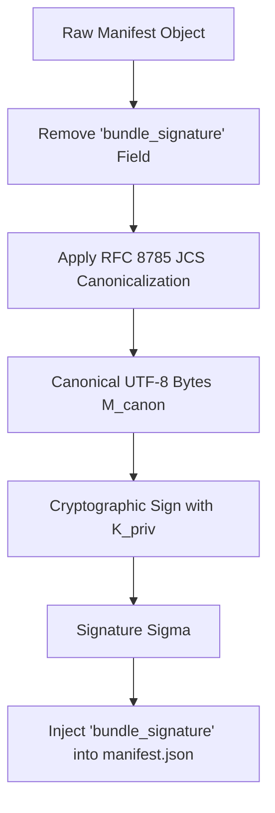
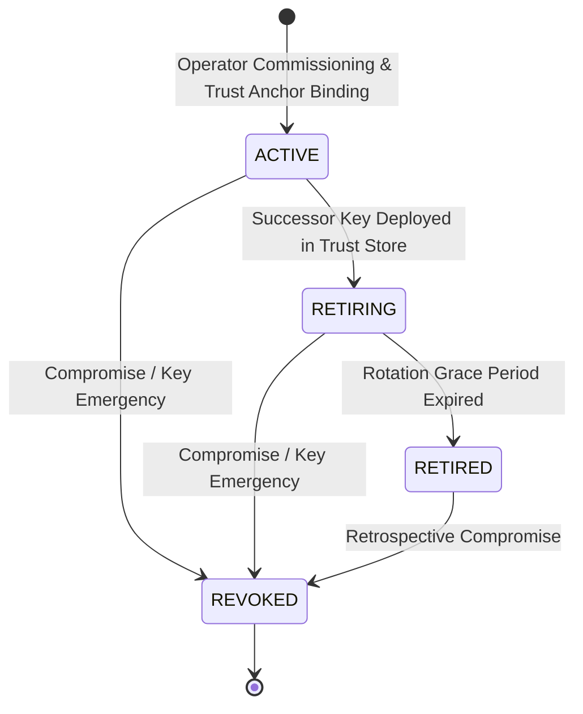
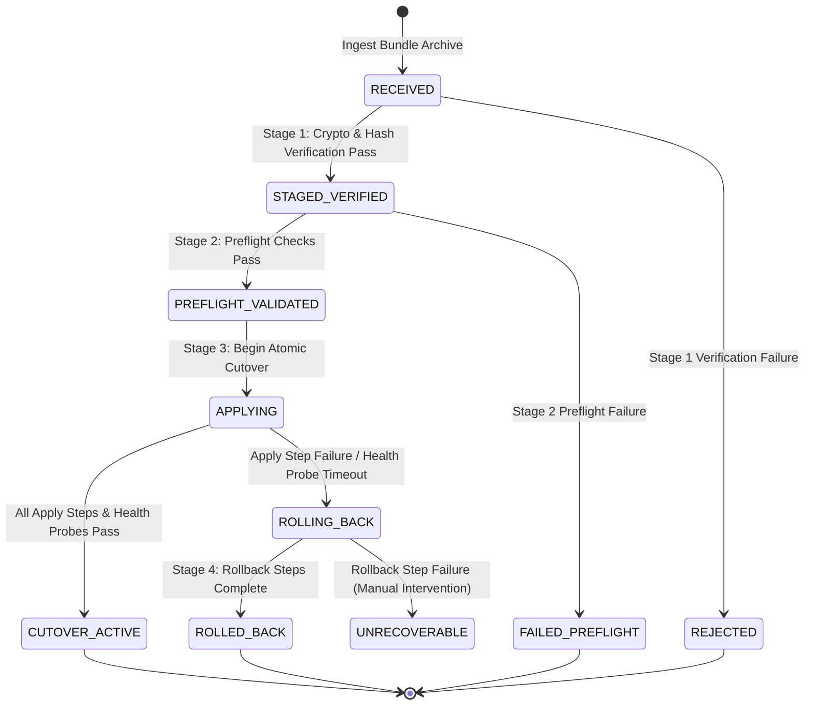

# CYBRIK Offline Installation & Update Manifest Contract Specification (v0.1.0-proposed)

- **Document Status:** `PROPOSED (Open-Item OPEN-1 Elaboration) — NOT ACCEPTED`
- **Contract Version:** `0.1.0`
- **Platform Capability Slot:** `Slot 13: artifact_update_mechanism`
- **Authority:** Architecture Contract Authority Only (Subordinate to ADR-0015 & Platform Contract Proposal v0.1.0)
- **Decider:** FOUNDER
- **Normative Invariant Citations:** `INV-1`, `INV-3`, `INV-5`, `INV-17`, `INV-21`, `INV-22`, `ADR-0001`, `ADR-0005`, `ADR-0006`, `ADR-0008`, `ADR-0015`

---

## 1. Executive Summary & Normative Scope

### 1.1 Context & Purpose
Under the CYBRIK Autonomous Security Operations Platform Contract (ADR-0015 §5.2), capability **Slot 13 (`artifact_update_mechanism`)** mandates a cryptographically verifiable, deterministic, and provider-neutral mechanism for offline installation, air-gapped updates, trust root anchoring, and rollback guarantees.

This specification elaborates **OPEN-1 (`OFFLINE_INSTALL_UPDATE_CONTRACT`)**, providing the complete normative requirements for:
1. Air-gapped bundle archive packaging, directory hierarchy, and OCI image layout.
2. Cryptographic signature and trust anchoring via detached Ed25519, ECDSA P-256, and RSA-PSS signatures over RFC 8785 JSON Canonicalization Scheme (JCS) payloads.
3. Operator-owned root trust store, offline key rotation state machines, and Key Revocation Lists (KRL/CRL).
4. Exact SHA-256 digest and byte-size pinning across container images, Python wheels, binaries, database migration scripts, and metadata.
5. Deterministic four-phase update-station execution workflow: Staged Verification → Pre-Apply Validation → Atomic Cutover → Automated Rollback.
6. Formal binding to the schema `cybrik.offline-install-update-manifest.v1.schema.json`.

### 1.2 Normative Conformance Language
The key words **MUST**, **MUST NOT**, **REQUIRED**, **SHALL**, **SHALL NOT**, **SHOULD**, **SHOULD NOT**, **RECOMMENDED**, **MAY**, and **OPTIONAL** in this document are to be interpreted as described in BCP 14 ([RFC 2119], [RFC 8174]) when, and only when, they appear in all capitals, as shown here.

### 1.3 Strict Non-Claims and Operational Boundaries
In accordance with ADR-0015 §1.2 and Platform Contract §1.1, this specification maintains strict non-claims:
- **NO Production Deployment Authority:** Acceptance of this specification establishes an architectural and contract boundary only. It does **NOT** authorize deployment to production environments.
- **NO Founder Gate Bypass:** This specification does **NOT** bypass Founder release gates, staging qualification gates, or RC1 baseline controls.
- **NO Runtime Engine Selection:** This specification does **NOT** select a specific container runtime (e.g., containerd vs CRI-O), hypervisor, or Kubernetes distribution (retaining `OPEN-6` and `OPEN-7` under separate Founder decision).
- **NO Remote Network Dependency:** Verification and execution MUST NOT initiate outbound network connections or rely on remote trust endpoints (`jku`, `jwk`, `x5u`, `bundle_uri`).

---

## 2. Air-Gapped Bundle Architecture & Archive Layout

### 2.1 Archive Container Packaging
An offline installation or update bundle MUST be packaged as a single POSIX tar archive (optionally compressed using `gzip` or `zstandard`, indicated by `.tar`, `.tar.gz`, or `.tar.zst` file extensions).

The archive root MUST contain exactly one canonical update manifest named `manifest.json` at the top level. All referenced artifact files MUST reside within subdirectories relative to the archive root.

```text
cybrik-bundle-<release_tag>.tar
├── manifest.json                                 # Canonical update manifest (RFC 8785 JCS)
├── manifest.sig                                  # Detached binary/hex signature (optional mirror)
├── images/                                       # OCI container image tarballs / layout
│   ├── cybrik-soc-portal-v1.2.3.tar
│   ├── cybrik-ai-api-v1.2.3.tar
│   └── cybrik-fabric-control-v1.2.3.tar
├── wheels/                                       # Immutable Python wheels
│   ├── cybrik_ai_core-0.1.0-py3-none-any.whl
│   └── cybrik_fabric_control-0.1.0-py3-none-any.whl
├── binaries/                                     # Architecture-pinned executables
│   └── cybrik-executor-linux-amd64
├── migrations/                                   # Transactional DB schema migrations
│   ├── 0001_initial_schema.up.sql
│   ├── 0001_initial_schema.down.sql
│   ├── 0002_add_audit_tables.up.sql
│   └── 0002_add_audit_tables.down.sql
├── configs/                                      # Declarative configuration definitions
│   └── deployment-profile.json
└── procedures/                                   # Human/Automated runbooks & rollback guides
    └── ROLLBACK-PROCEDURE.md
```

### 2.2 Canonical Path Rules & Anti-Traversal Invariants
To prevent path traversal, directory escape, and alias collisions during extraction:

1. **Relative Path Construction:** Every entry in `artifacts[].path` MUST be a relative path strictly matching the regular expression:
   ```regex
   ^(?!/)(?!^\./)(?!.*\.\.)(?!.*(?:/\.|//|/$))[a-z0-9._/-]+[a-z0-9._-]$
   ```
2. **Prohibited Path Elements:**
   - MUST NOT start with a forward slash (`/`) or dot-slash (`./`).
   - MUST NOT contain parent directory traversal sequences (`..`).
   - MUST NOT contain hidden directory dot-segments (`/.` or `/../`).
   - MUST NOT contain double slashes (`//`).
   - MUST NOT terminate with a trailing slash (`/`).
3. **Normalized Path Uniqueness:** All artifact paths MUST be unique under POSIX and RFC 3986 path normalization. If two artifacts resolve to the same normalized filesystem location (e.g., `images/app.tar` and `images/./app.tar`), the bundle MUST fail validation immediately.
4. **Symlink Proscription:** Bundles MUST NOT contain symlinks targeting files outside the bundle root, broken symlinks, or hardlinks pointing across extraction boundaries.

### 2.3 Container Image Layout Requirements
Container images within the `images/` directory MUST conform to one of two standard formats:
1. **OCI Image Archive (`.tar`):** An archive generated per the [OCI Image Specification v1.0+], containing `oci-layout`, `index.json`, `manifest.json`, and layer blobs.
2. **Docker v2 Image Archive (`.tar`):** A standard image tarball generated via `docker save` or `podman save`, containing manifest, config, and layer tarballs.

Every image archive MUST be pinned by its exact SHA-256 digest in `artifacts[]`. The update station MUST load images directly into the local host container storage without performing remote image pulls.

### 2.4 Database Migration Script Packaging
Database migration scripts within the `migrations/` directory MUST satisfy:
1. **Bidirectional Migration Pairs:** Every forward migration script (`<seq>_<name>.up.sql`) MUST have an accompanying reverse migration script (`<seq>_<name>.down.sql`).
2. **Transactional Execution:** All SQL statements in a migration script MUST be executable within an ACID transaction block (`BEGIN` ... `COMMIT`).
3. **Idempotence & Reversibility:** Down-migrations MUST cleanly restore the database schema and constraints to the exact pre-migration state without data corruption. Manifests MUST declare `"migration_reversibility_guaranteed": true`.

---

## 3. Cryptographic Signing, Key Management & Trust Store Model

### 3.1 Canonical Manifest Signing Recipe (RFC 8785 JCS)
To eliminate signature malleability caused by JSON whitespace, key ordering, and floating-point variances, manifest signatures MUST be generated and verified using the **RFC 8785 JSON Canonicalization Scheme (JCS)**.

#### Signature Computation Algorithm:
1. Construct the complete manifest JSON object containing all required fields except `bundle_signature`.
2. Apply RFC 8785 JCS canonicalization to serialize the object into an unambiguous, deterministic UTF-8 byte stream $M_{canon}$.
3. Compute the cryptographic signature $\Sigma$ over $M_{canon}$ using the operator private key corresponding to `operator_trust_root.signing_key_id`:
   $$\Sigma = \text{Sign}(K_{priv}, M_{canon})$$
4. Encode $\Sigma$ (or its binary signature value) into the `bundle_signature` field formatted according to the algorithm profile (Base64 / Base64URL).
5. The final `manifest.json` file is written containing the `bundle_signature` property.



#### Verification Algorithm:
1. Parse `manifest.json` and extract `bundle_signature`.
2. Create a shallow copy of the manifest object, deleting the `bundle_signature` key.
3. Canonicalize the remaining object using RFC 8785 JCS into byte sequence $M'_{canon}$.
4. Look up the trusted public key $K_{pub}$ in the local operator root trust store matching `signing_key_id` and `public_key_fingerprint`.
5. Verify $\Sigma$ against $M'_{canon}$ using $K_{pub}$ and `operator_trust_root.signature_algorithm`:
   $$\text{Verify}(K_{pub}, M'_{canon}, \Sigma) \stackrel{?}{=} \text{TRUE}$$
6. If verification fails, the bundle MUST be rejected immediately.

### 3.2 Supported Signature Algorithms
The `operator_trust_root.signature_algorithm` MUST be explicitly declared and restricted to one of the following approved cryptographic suites:

| Algorithm Identifier | Description | Key Specification | Signature Encoding |
|---|---|---|---|
| `ed25519` | EdDSA over Curve25519 (RFC 8032) — **RECOMMENDED** | 256-bit Ed25519 public key | Raw 64-byte signature (Base64/Base64URL) |
| `ecdsa-p256-sha256` | ECDSA over NIST P-256 with SHA-256 (FIPS 186-4) | 256-bit P-256 public key | IEEE P1363 (r \|\| s) or ASN.1 DER (Base64) |
| `rsa-pss-sha256` | RSA-PSS with SHA-256, MGF1, salt len 32 | RSA $\ge$ 3072-bit public key | PKCS #1 v2.1 PSS signature (Base64) |

Algorithms using weak primitives (`none`, `md5`, `sha1`, `rsa-pkcs1v1.5`, `secp256k1`) MUST be rejected unconditionally.

### 3.3 Operator Root Trust Store Architecture
Air-gapped environments MUST maintain a local, operator-curated, write-protected root trust store on the update station host.

```text
/etc/cybrik/trust-store/
├── trust-store.json                              # Machine-readable trust root registry
├── keys/                                         # Public key material (PEM / DER)
│   ├── key-ops-root-2026.pub.pem
│   └── key-ops-release-2026a.pub.pem
└── crl/                                          # Signed Key Revocation Lists
    └── crl-2026-08.json
```

The `trust-store.json` file registers trusted signing keys:
```json
{
  "trust_store_version": "1.0",
  "operator_identity": "urn:cybrik:operator:sovereign-soc",
  "trusted_roots": [
    {
      "signing_key_id": "key-ops-2026a",
      "public_key_fingerprint": "e3b0c44298fc1c149afbf4c8996fb92427ae41e4649b934ca495991b7852b855",
      "signature_algorithm": "ed25519",
      "public_key_path": "keys/key-ops-release-2026a.pub.pem",
      "status": "ACTIVE",
      "valid_from": "2026-01-01T00:00:00Z",
      "valid_until": "2027-01-01T00:00:00Z"
    }
  ]
}
```

### 3.4 Key Lifecycle & Offline Rotation Model
Keys in the operator trust store transition through a strict monotone lifecycle:



- **ACTIVE:** Authorized to sign new update bundles and verify current installations.
- **RETIRING:** Authorized to verify existing and in-flight bundles; prohibited from signing new bundles.
- **RETIRED:** Retained for historical audit and rollback verification only; cannot sign.
- **REVOKED:** Immediately prohibited from all verification and installation activities.

### 3.5 Offline Revocation Model (KRL / CRL)
1. **Revocation List Distribution:** In air-gapped environments, revocation lists MUST be distributed out-of-band via operator media and cryptographically signed by the operator master key.
2. **Mandatory Revocation Checking:** Before validating a manifest signature, the update station verifier MUST query the local CRL. If either `signing_key_id` or `public_key_fingerprint` appears in the active revocation list, verification MUST terminate with a fatal `KEY_REVOKED` error.
3. **Prohibition of Network Lookups:** The verifier MUST NOT attempt online OCSP queries or fetch CRLs over network interfaces.

---

## 4. Exact Digest Pinning & Artifact Integrity Verification

### 4.1 SHA-256 Digest Pinning
Every artifact included in the bundle archive MUST have an exact SHA-256 cryptographic checksum declared in the `artifacts[]` table of `manifest.json`.

- The `sha256` value MUST be a lowercase 64-character hexadecimal string conforming to `^[a-f0-9]{64}$`.
- The `size_bytes` value MUST be an exact positive integer representing the byte length of the uncompressed or stored artifact file.

```json
{
  "name": "cybrik-ai-api-image",
  "path": "images/cybrik-ai-api-v1.2.3.tar",
  "sha256": "4b227777d4dd1fc61c6f884f48641d02b4d121d3fd328cb08b5531fcacdabf8a",
  "size_bytes": 412589056
}
```

### 4.2 Streaming Verification Protocol
During bundle ingestion and verification:
1. **Pre-Allocation & Disk Quota Check:** The update station calculates the sum of all `artifacts[].size_bytes` plus required staging headroom. If available disk storage is insufficient, ingestion terminates before extraction.
2. **Streaming Digest Calculation:** As files are extracted or read from the archive, their contents are streamed through a SHA-256 digest accumulator.
3. **Fail-Closed Digest Matching:** The computed SHA-256 digest and total byte count are compared against the manifest entries. If any byte diverges or the digest does not match, the entire staging workspace is purged and the update is rejected.

---

## 5. Deterministic Update Station Workflow Engine

### 5.1 Update Station State Machine
The update station executes a deterministic four-stage lifecycle:



### 5.2 Stage 1: Ingestion & Staged Verification
In Stage 1, the update station processes the raw bundle in an isolated staging workspace without modifying live production state:

1. **Phase 1 Structural Schema Validation:** Validate `manifest.json` against `cybrik.offline-install-update-manifest.v1.schema.json`.
2. **Phase 2 Semantic Path Validation:** Normalize all `artifacts[].path` entries; ensure no duplicate paths, traversal tokens, or aliased locations exist.
3. **Trust Anchor Resolution:** Retrieve `operator_trust_root.signing_key_id` from `/etc/cybrik/trust-store/trust-store.json`. Verify key is `ACTIVE` and not revoked in `crl.json`. Verify public key fingerprint matches `operator_trust_root.public_key_fingerprint`.
4. **Canonical Signature Verification:** Reconstruct canonical manifest bytes omitting `bundle_signature` via RFC 8785 JCS; verify `bundle_signature` with the trusted public key.
5. **Artifact Integrity Verification:** Streamingly unpack each artifact to the staging directory; compute SHA-256 digest and byte size; verify 100% concordance with `artifacts[]`.

### 5.3 Stage 2: Pre-Apply Validation (Preflight)
Stage 2 executes all commands specified in `update_station_workflow.preflight_steps` sequentially:

1. **Storage & Capacity Probing:** Verify disk volumes for database, container image store, and application logs have at least 2.5× the required deployment capacity.
2. **Host Dependency & Substrate Checks:** Validate container runtime socket responsiveness, kernel parameter compliance, and isolation substrate readiness (ADR-0005 S0–S4).
3. **Database Preflight & Backup:**
   - Verify active database connectivity and transactional lock availability.
   - Trigger a consistent, pre-update database snapshot / WAL backup.
   - Verify existence of corresponding down-migration scripts for all pending migrations.
4. **Configuration Validation:** Validate target deployment configuration against `cybrik.deployment-profile.v1.schema.json`.

If any preflight step fails, the update station halts immediately, records diagnostics, purges the staging area, and leaves the live system unaffected.

### 5.4 Stage 3: Atomic Cutover (Apply)
Stage 3 executes all commands specified in `update_station_workflow.apply_steps` in strict deterministic order:

1. **Container Image Pre-Loading:** Load OCI image tarballs from `images/` into the local container runtime image store (`podman load`, `containerd-ctr images import`, or runtime-specific loader).
2. **Transactional Database Migration:**
   - Open database transaction block.
   - Execute forward migration scripts (`migrations/*.up.sql`) in sequential numerical order.
   - Commit transaction and record migration state in schema history table.
3. **Workload Rollout & Cutover:**
   - Deploy new container workload instances alongside existing versions (blue-green or rolling canary).
   - Switch local traffic router / ingress endpoints to new instances.
   - Drain active connections from superseded instances.
4. **Post-Deployment Health Probe Gate:**
   - Execute local readiness and liveness probes against core service endpoints (`/healthz`, `/readyz`).
   - Monitor error rates and latency across a configurable stabilization window (default: 120 seconds).
5. **Completion:** On successful stabilization, mark the update as `CUTOVER_ACTIVE`, decommission superseded container instances, and archive the installation manifest to `/var/log/cybrik/updates/`.

### 5.5 Stage 4: Automated Rollback on Failure
If any error occurs during Stage 3 (`apply_steps`) or if post-deployment health probes fail before stabilization completes:

1. **Immediate Execution of Rollback Steps:** The update station immediately halts application rollout and executes `update_station_workflow.rollback_steps` referencing `rollback_procedure_reference`.
2. **Traffic Reversion:** Traffic routing and internal service delegations are immediately switched back to the previous stable workload instances.
3. **Database Schema Rollback:**
   - If database migrations were committed, execute reverse migration scripts (`migrations/*.down.sql`) in reverse numerical order within a transaction block.
   - If migration failed mid-transaction, allow transaction `ROLLBACK` to restore state; if schema inconsistency is detected, restore from the Stage 2 database snapshot.
4. **Runtime Cleanup:** Stop and remove newly spawned failing container instances; prune transient staging files.
5. **Audit Logging & Alerting:** Record full failure telemetry, stderr logs, and rollback receipts to `/var/log/cybrik/updates/failure.log` and local audit ledgers.

---

## 6. Manifest Structure & Schema Specification

### 6.1 Manifest Properties Reference
The offline update manifest is governed by the schema `cybrik.offline-install-update-manifest.v1.schema.json`.

| Property | Type | Requirement | Description |
|---|---|---|---|
| `bundle_identifier` | `string` | **REQUIRED** | Unique alphanumeric bundle ID matching `^[a-z0-9][a-z0-9-_]+$` |
| `release_tag` | `string` | **REQUIRED** | SemVer release tag matching `^v(0\|[1-9]\d*)\.(0\|[1-9]\d*)\.(0\|[1-9]\d*)(?:-([a-z0-9.-]+))?$` |
| `operator_trust_root` | `object` | **REQUIRED** | Operator signing key metadata containing `signing_key_id`, `public_key_fingerprint`, and `signature_algorithm` |
| `bundle_signature` | `string` | **REQUIRED** | Detached cryptographic signature over canonical JCS manifest bytes |
| `artifacts` | `array` | **REQUIRED** | List of $\ge 1$ artifacts with `name`, `path`, `sha256`, and `size_bytes` |
| `migration_reversibility_guaranteed` | `boolean` | **REQUIRED** | MUST be constant `true` |
| `rollback_procedure_reference` | `string` | **REQUIRED** | URI/reference to rollback documentation (min length: 5) |
| `update_station_workflow` | `object` | **REQUIRED** | Workflow object containing `preflight_steps[]`, `apply_steps[]`, and `rollback_steps[]` |
| `canonicalization_scheme` | `string` | **REQUIRED** | MUST be constant `"RFC_8785_JCS"` |

### 6.2 Complete Normative Example

```json
{
  "bundle_identifier": "cybrik-soc-update-20260827-01",
  "release_tag": "v0.1.0",
  "operator_trust_root": {
    "signing_key_id": "key-ops-release-2026a",
    "public_key_fingerprint": "e3b0c44298fc1c149afbf4c8996fb92427ae41e4649b934ca495991b7852b855",
    "signature_algorithm": "ed25519"
  },
  "bundle_signature": "MEUCIQDv4x8+7V5R8kK...EXAMPLE_DETACHED_SIGNATURE_BASE64...1gIga8Q==",
  "artifacts": [
    {
      "name": "cybrik-soc-portal-image",
      "path": "images/cybrik-soc-portal-v0.1.0.tar",
      "sha256": "9f86d081884c7d659a2feaa0c55ad015a3bf4f1b2b0b822cd15d6c15b0f00a08",
      "size_bytes": 314572800
    },
    {
      "name": "cybrik-ai-api-image",
      "path": "images/cybrik-ai-api-v0.1.0.tar",
      "sha256": "5e884898da28047151d0e56f8dc6292773603d0d6aabbdd62a11ef721d1542d8",
      "size_bytes": 419430400
    },
    {
      "name": "cybrik-fabric-control-image",
      "path": "images/cybrik-fabric-control-v0.1.0.tar",
      "sha256": "4b227777d4dd1fc61c6f884f48641d02b4d121d3fd328cb08b5531fcacdabf8a",
      "size_bytes": 262144000
    },
    {
      "name": "db-migration-0001-up",
      "path": "migrations/0001_initial_schema.up.sql",
      "sha256": "ef2d127de37b942baad06145e54b0c619a1f22327b2ebbcfbec78f5564afe39d",
      "size_bytes": 14320
    },
    {
      "name": "db-migration-0001-down",
      "path": "migrations/0001_initial_schema.down.sql",
      "sha256": "8f434346648f6b96df89dda901c5176b10a6d83961dd3c1ac88b59b2dc327aa4",
      "size_bytes": 4820
    },
    {
      "name": "rollback-playbook",
      "path": "procedures/ROLLBACK-PROCEDURE.md",
      "sha256": "a591a6d40bf420404a011733cfb7b190d62c65bf0bcda32b57b277d9ad9f146e",
      "size_bytes": 8290
    }
  ],
  "migration_reversibility_guaranteed": true,
  "rollback_procedure_reference": "file://procedures/ROLLBACK-PROCEDURE.md",
  "update_station_workflow": {
    "preflight_steps": [
      "/usr/local/bin/cybrik-preflight --check-storage --min-free-gb=50",
      "/usr/local/bin/cybrik-preflight --check-db-connection",
      "/usr/local/bin/cybrik-preflight --backup-database /var/backups/cybrik/pre-v0.1.0.sql"
    ],
    "apply_steps": [
      "/usr/local/bin/cybrik-apply --load-images",
      "/usr/local/bin/cybrik-apply --migrate-database",
      "/usr/local/bin/cybrik-apply --deploy-workloads",
      "/usr/local/bin/cybrik-apply --verify-health --timeout=120s"
    ],
    "rollback_steps": [
      "/usr/local/bin/cybrik-rollback --traffic-revert",
      "/usr/local/bin/cybrik-rollback --migrate-down",
      "/usr/local/bin/cybrik-rollback --restore-workloads"
    ]
  },
  "canonicalization_scheme": "RFC_8785_JCS"
}
```

---

## 7. Deployment Profile Alignment & Isolation Matrix

### 7.1 Slot 13 Profile Matrix
The `artifact_update_mechanism` capability (Slot 13) is evaluated across the four canonical CYBRIK deployment profiles (ADR-0015 §6):

| Deployment Profile | Profile ID | Slot 13 Strength | Air-Gap Requirement | Verification Mode |
|---|---|---|---|---|
| **On-Premises Air-Gapped** | `onprem-airgap-v1` | `MANDATORY` | Full Air-Gap (S3 Isolation Floor) | Local Root Trust Store + Offline CRL |
| **On-Premises Standard** | `onprem-standard-v1` | `MANDATORY` | Air-Gap Capable / Local Mirror | Local Root Trust Store + Offline CRL |
| **Hybrid Sovereign** | `hybrid-sovereign-v1` | `MANDATORY` | Dual (Local Core + Controlled Egress) | Local Root Trust Store + Operator Mirror |
| **Private Cloud** | `private-cloud-v1` | `MANDATORY` | Dedicated Sovereign VPC / Subnet | Local Root Trust Store + Operator Key Registry |

### 7.2 Isolation Floor Guarantees (ADR-0005)
1. **S3 Air-Gap Isolation:** In `onprem-airgap-v1`, all image loading, artifact extraction, and migration operations MUST execute with `FAIL_CLOSED_NO_EGRESS` network posture.
2. **Deterministic Workspace Disposal:** Staging directories and temporary extraction artifacts MUST be created with restricted POSIX permissions (`0700`) and securely purged upon workflow completion or failure.

---

## 8. Threat Model & Failure Mode Analysis

| Threat / Failure Scenario | Attack Vector / Mechanism | Mitigation & Contractual Guarantee |
|---|---|---|
| **Tampered Artifact in Transit** | Modifying container image layer or SQL migration script inside the tarball archive. | **Fail-Closed Digest Verification:** Streaming SHA-256 computation over artifact bytes matches against signed `manifest.json`. Any divergence immediately halts the update. |
| **Manifest Modification / Forgery** | Altering `artifacts[].sha256` or workflow steps in `manifest.json`. | **RFC 8785 JCS Cryptographic Signing:** Detached signature verification fails because attacker cannot forge signature under operator private key. |
| **Path Traversal / Host File Overwrite** | Malicious relative paths (e.g., `../../../../etc/shadow`). | **Strict Path Regex & Normalization:** Schema regex `^(?!/)...` and Phase 2 POSIX normalization reject all dot-segments, absolute paths, and aliased paths. |
| **Compromised Signing Key** | Adversary obtains an older or compromised operator signing key. | **Offline CRL / Revocation Check:** Verifier consults local `crl.json` before signature check; revoked `signing_key_id` or fingerprint triggers fatal abort. |
| **Replay of Deprecated / Vulnerable Bundle** | Attacker replays a validly signed, older bundle containing known vulnerabilities. | **Monotone Release Tag & Version Enforcer:** Update station enforces strictly monotone `release_tag` progression and rejects downgrade attempts unless explicit rollback mode is invoked. |
| **Partial Failure During Apply** | Power loss or runtime crash during container rollout or SQL migration. | **Stage 4 Automated Rollback & ACID Migrations:** Reversible SQL migrations (`migration_reversibility_guaranteed: true`) and transaction rollback restore pre-update state. |
| **Disk Exhaustion During Extraction** | Large bundle exhausts host disk space, causing denial of service. | **Preflight Quota Reservation:** Stage 2 preflight validates $\ge 2.5\times$ aggregate `size_bytes` disk headroom before any extraction begins. |

---

## 9. Governance, Lifecycle & Non-Claims

### 9.1 Lifecycle Status
This document is statused as **`PROPOSED (Open-Item OPEN-1 Elaboration) — NOT ACCEPTED`**.

Moving this contract from `PROPOSED` to `ACCEPTED FOR IMPLEMENTATION` requires formal Founder approval under ADR-0001 lifecycle governance.

### 9.2 Resolution of Open Item OPEN-1
This specification fully elaborates and satisfies the architectural and contract requirements for **OPEN-1 (`OFFLINE_INSTALL_UPDATE_CONTRACT`)** under ADR-0015 §14.

Upon Founder review and acceptance:
- `OPEN-1` status transitions to `RESOLVED` (Architecture Contract Authority Only).
- Product repositories (`cybrik-soc-command-center`, `cybrik-cyber-ai-platform`, `cybrik-security-tool-fabric`) obtain the normative standard for building offline packaging tooling and update-station agents without introducing provider lock-in or unverified dependencies.
