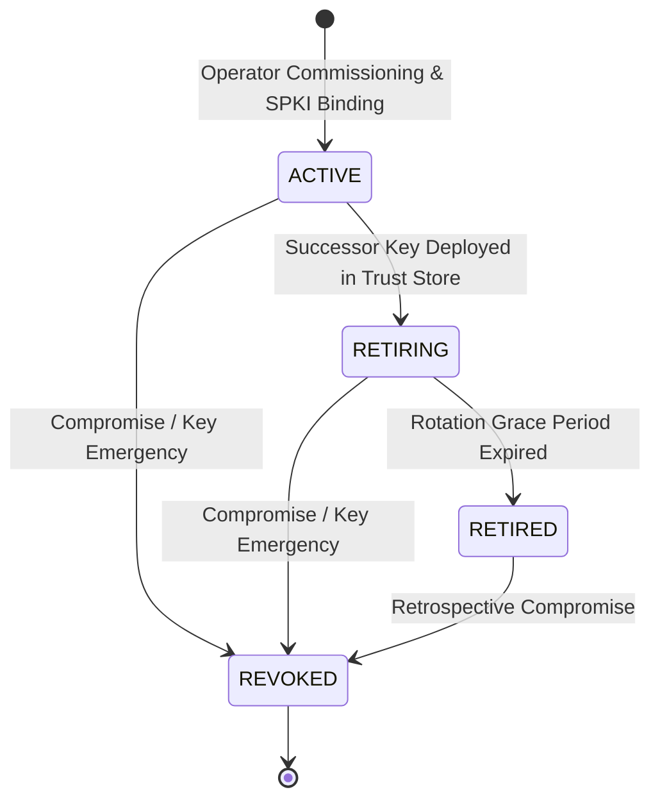
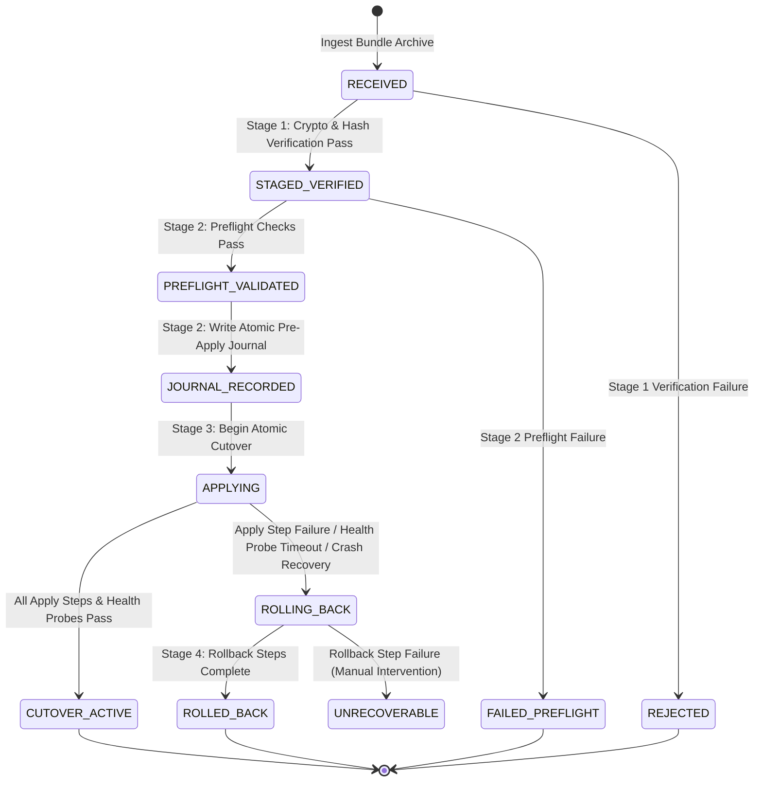

# CYBRIK Offline Installation & Update Manifest Contract Specification (v0.1.0-proposed)

- **Document Status:** `PROPOSED (Open-Item Elaboration) — NOT ACCEPTED`
- **Contract Version:** `0.1.0`
- **Platform Capability Slot:** `Slot 13: artifact_update_mechanism`
- **Authority:** Architecture Contract Authority Only (Subordinate to ADR-0015 & Platform Contract Proposal v0.1.0)
- **Decider:** FOUNDER
- **Normative Invariant Citations:** `INV-1`, `INV-3`, `INV-5`, `INV-17`, `INV-21`, `INV-22`, `ADR-0001`, `ADR-0005`, `ADR-0006`, `ADR-0008`, `ADR-0015`

---

## 1. Executive Summary & Normative Scope

### 1.1 Context & Purpose
Under the CYBRIK Autonomous Security Operations Platform Contract (ADR-0015 §5.2), capability **Slot 13 (`artifact_update_mechanism`)** mandates a cryptographically verifiable, deterministic, and provider-neutral mechanism for offline installation, air-gapped updates, trust root anchoring, and rollback guarantees.

This specification elaborates **OPEN-1 (`OFFLINE_INSTALL_UPDATE_CONTRACT`)**, providing the complete normative requirements for:
1. Air-gapped bundle archive packaging (POSIX.1-2001 PAX format), directory hierarchy, zero symlink enforcement, and OCI image layout.
2. Cryptographic signature and trust anchoring via detached Ed25519 signatures ONLY (`manifest.sig`, strictly 64 octets binary) over RFC 8785 JSON Canonicalization Scheme (JCS) canonical `manifest.json` under strict I-JSON (RFC 7493) constraints.
3. Operator-owned root trust store, monotone `manifest_sequence` freshness constraints evaluated against `minimum_freshness_sequence` for monotonic anti-rollback, offline key rotation state machines, and Key Revocation Lists (KRL/CRL).
4. Exact SHA-256 digest and byte-size pinning across every container image, Python wheel, binary, database migration script, and metadata file in the archive, with exhaustive 1:1 archive entry whitelisting (fail-closed extraction abort on any unlisted entry or symlink).
5. Deterministic four-phase update-station execution workflow with closed declarative action grammar and strict action-specific parameter schemas (`VERIFY_DIGEST`, `PRELOAD_OCI_IMAGE`, `APPLY_SQL_MIGRATION`, `HEALTH_PROBE`, `RESTORE_DATABASE_SNAPSHOT`), pre-apply journaling/snapshot, crash-replay recovery, and idempotent procedural rollback.
6. Formal binding to the schema `cybrik.offline-install-update-manifest.v1.schema.json`.

### 1.2 Normative Conformance Language
The key words **MUST**, **MUST NOT**, **REQUIRED**, **SHALL**, **SHALL NOT**, **SHOULD**, **SHOULD NOT**, **RECOMMENDED**, **MAY**, and **OPTIONAL** in this document are to be interpreted as described in BCP 14 ([RFC 2119], [RFC 8174]) when, and only when, they appear in all capitals, as shown here.

### 1.3 Strict Non-Claims and Operational Boundaries
In accordance with ADR-0015 §1.2 and Platform Contract §1.1, this specification maintains strict non-claims:
- **NO Production Deployment Authority:** Acceptance of this specification establishes an architectural and contract boundary only. It does **NOT** authorize deployment to production environments.
- **NO Founder Gate Bypass:** This specification does **NOT** bypass Founder release gates, staging qualification gates, or RC1 baseline controls.
- **NO Runtime Engine Selection:** This specification does **NOT** select a specific container runtime (e.g., containerd vs CRI-O), hypervisor, or Kubernetes distribution (retaining `OPEN-6` and `OPEN-7` under separate Founder decision).
- **NO Remote Network Dependency:** Verification and execution MUST NOT initiate outbound network connections or rely on remote trust endpoints (`jku`, `jwk`, `x5u`, `bundle_uri`).

---

## 2. Air-Gapped Bundle Architecture & Archive Layout

### 2.1 Archive Container Packaging
An offline installation or update bundle MUST be packaged as a single POSIX.1-2001 PAX format archive (optionally compressed using `gzip` or `zstandard`, indicated by `.tar`, `.tar.gz`, or `.tar.zst` file extensions).

The archive root MUST contain exactly one canonical update manifest named `manifest.json` and its companion detached cryptographic signature named `manifest.sig` at the top level. All referenced artifact files MUST reside within subdirectories relative to the archive root.

```text
cybrik-bundle-<release_tag>.tar
├── manifest.json                                 # Canonical update manifest (RFC 8785 JCS / I-JSON)
├── manifest.sig                                  # Detached cryptographic signature (exact 64-byte Ed25519 signature over canonical manifest.json)
├── images/                                       # OCI container image tarballs / layout
│   ├── cybrik-soc-portal-v1.2.3.tar
│   ├── cybrik-ai-api-v1.2.3.tar
│   └── cybrik-fabric-control-v1.2.3.tar
├── wheels/                                       # Immutable Python wheels
│   ├── cybrik_ai_core-0.1.0-py3-none-any.whl
│   └── cybrik_fabric_control-0.1.0-py3-none-any.whl
├── binaries/                                     # Architecture-pinned executables
│   └── cybrik-executor-linux-amd64
├── migrations/                                   # Transactional DB schema migrations
│   ├── 0001_initial_schema.up.sql
│   ├── 0001_initial_schema.down.sql
│   ├── 0002_add_audit_tables.up.sql
│   └── 0002_add_audit_tables.down.sql
├── configs/                                      # Declarative configuration definitions
│   └── deployment-profile.json
└── procedures/                                   # Human/Automated runbooks & rollback guides
    └── ROLLBACK-PROCEDURE.md
```

### 2.2 Canonical Path Rules & Strict Archive Traversal Safety
To prevent path traversal, directory escape, alias collisions, archive injection, and malicious file creation during extraction:

1. **Relative Path Construction:** Every entry in `artifacts[].path` MUST be a relative path strictly matching the regular expression:
   ```regex
   ^(?!/)(?!^\./)(?!.*\.\.)(?!.*(?:/\.|//|/$))[a-z0-9._/-]+[a-z0-9._-]$
   ```
2. **Prohibited Path Elements:**
   - MUST NOT start with a forward slash (`/`) or dot-slash (`./`).
   - MUST NOT contain parent directory traversal sequences (`..`).
   - MUST NOT contain hidden directory dot-segments (`/.` or `/../`).
   - MUST NOT contain double slashes (`//`).
   - MUST NOT terminate with a trailing slash (`/`).
3. **Normalized Path Uniqueness:** All artifact paths MUST be unique under POSIX and RFC 3986 path normalization. If two artifacts resolve to the same normalized filesystem location (e.g., `images/app.tar` and `images/./app.tar`), the bundle MUST fail validation immediately.
4. **Zero Symlink & Hardlink Prohibition:** Any symlink (relative or absolute) and any hardlink are strictly prohibited in the air-gap PAX archive. Bundles MUST NOT contain any symlinks (relative or absolute) or hardlinks under any circumstances. Extraction verifiers MUST reject any bundle containing symlinks or hardlinks with an immediate fail-closed extraction abort.
5. **Exhaustive 1:1 Archive Entry Manifest Binding & Fail-Closed Whitelisting:**
   - EVERY entry in the tar archive (excluding the root directory itself, `manifest.json`, and `manifest.sig`) MUST be explicitly listed in `artifacts[]` with its exact relative path, SHA-256 digest, and byte size.
   - Any unlisted file, unrecognized directory entry, hardlink, symlink (relative or absolute), FIFO / named pipe, unix socket, block device node, or character device node encountered during archive traversal MUST cause an immediate fail-closed extraction abort, workspace purge, and recording of an `ARCHIVE_UNLISTED_ENTRY_ABORT` audit violation.

### 2.3 Container Image Layout Requirements
Container images within the `images/` directory MUST conform to one of two standard formats:
1. **OCI Image Archive (`.tar`):** An archive generated per the [OCI Image Specification v1.0+], containing `oci-layout`, `index.json`, `manifest.json`, and layer blobs.
2. **Docker v2 Image Archive (`.tar`):** A standard image tarball generated via `docker save` or `podman save`, containing manifest, config, and layer tarballs.

Every image archive MUST be pinned by its exact SHA-256 digest in `artifacts[]`. The update station MUST load images directly into the local host container storage without performing remote image pulls.

### 2.4 Database Migration Script Packaging
Database migration scripts within the `migrations/` directory MUST satisfy:
1. **Bidirectional Migration Pairs:** Every forward migration script (`<seq>_<name>.up.sql`) MUST have an accompanying reverse migration script (`<seq>_<name>.down.sql`).
2. **Transactional Execution:** All SQL statements in a migration script MUST be executable within an ACID transaction block (`BEGIN` ... `COMMIT`).
3. **Idempotence & Reversibility:** Down-migrations MUST cleanly restore the database schema and constraints to the exact pre-migration state without data corruption. Manifests MUST declare `"migration_reversibility_guaranteed": true`.

---

## 3. Cryptographic Signing, Key Management & Trust Store Model

### 3.1 Canonical Manifest Signing Recipe (RFC 8785 JCS & RFC 7493 I-JSON)
To eliminate signature malleability caused by JSON whitespace, key ordering, and floating-point variances, manifest signatures MUST be generated and verified using the **RFC 8785 JSON Canonicalization Scheme (JCS)** under strict **I-JSON (RFC 7493)** constraints.

#### Strict I-JSON & JCS Invariants:
1. **Duplicate Key Prohibition:** In accordance with RFC 7493 §2.2 and RFC 8785 §3.2.4, JSON objects MUST NOT contain duplicate keys. Update-station JSON parsers MUST operate in strict duplicate-rejection mode and fail closed immediately upon encountering duplicate object keys.
2. **IEEE-754 Safe Integer Range Invariant:** In accordance with RFC 7493 §2.1, all numeric values (e.g., `manifest_sequence`, `size_bytes`, `timeout_seconds`) MUST be exact integers within the IEEE-754 double-precision safe integer range $[-(2^{53}-1), 2^{53}-1]$ (i.e. $[-9007199254740991, 9007199254740991]$). Floating-point values, scientific notation, or numbers outside this range MUST be rejected.
3. **Strict UTF-8 Encoding:** Payloads MUST be strictly UTF-8 encoded without a Byte Order Mark (BOM).
4. **Detached Ed25519 Signature Only:** The cryptographic signature MUST be provided as a detached file `manifest.sig` (located in the pax archive root or delivered alongside `manifest.json`) containing the exact 64-byte Ed25519 binary signature over the RFC 8785 JCS canonical UTF-8 byte stream of `manifest.json`. Embedded signatures, in-band signature envelopes, or signature mirroring inside `manifest.json` are strictly prohibited. The manifest JSON includes a `detached_signature` declaration object specifying the algorithm (`"ed25519"`), signature file (`"manifest.sig"`), and the SHA-256 SPKI fingerprint of the signing key.

#### Signature Computation Algorithm:
1. Construct the complete `manifest.json` object containing all required properties (`bundle_identifier`, `release_tag`, `manifest_sequence`, `operator_trust_root`, `detached_signature`, `artifacts`, `migration_reversibility_guaranteed`, `rollback_procedure_reference`, `update_station_workflow`, `canonicalization_scheme`).
2. Validate strict I-JSON rules: verify UTF-8 encoding (no BOM), reject duplicate object keys, and verify all numbers are exact integers within IEEE-754 safe integer range $[-(2^{53}-1), 2^{53}-1]$.
3. Apply RFC 8785 JCS canonicalization over `manifest.json` to serialize the document into an unambiguous, deterministic UTF-8 byte stream $M_{canon}$.
4. Compute the Ed25519 signature $\Sigma$ (exact 64 binary octets) over $M_{canon}$ using the operator private key corresponding to `operator_trust_root.signing_key_id`:
   $$\Sigma = \text{Sign}_{\text{Ed25519}}(K_{priv}, M_{canon})$$
5. Write the exact 64-byte binary signature $\Sigma$ directly to detached file `manifest.sig`.

```mermaid
flowchart TD
    A[Construct Complete manifest.json] --> B[Validate Strict I-JSON Rules: No Dups, Safe Ints]
    B --> C[Apply RFC 8785 JCS Canonicalization]
    C --> D[Canonical UTF-8 Bytes M_canon]
    D --> E[Compute Ed25519 Signature with K_priv]
    E --> F[Write Detached manifest.sig (64 Binary Octets)]
```

#### Verification Algorithm:
1. Read `manifest.json` and companion detached `manifest.sig` (verifying `manifest.sig` is exactly 64 binary bytes).
2. Verify strict I-JSON rules on `manifest.json`: reject if duplicate keys, floating-point numbers, or out-of-safe-range numbers are present.
3. Look up the trusted public key $K_{pub}$ in `/etc/cybrik/trust-store/trust-store.json` matching `operator_trust_root.signing_key_id` and `operator_trust_root.public_key_fingerprint`. Verify `signature_algorithm` is `ed25519`.
4. Canonicalize `manifest.json` using RFC 8785 JCS into canonical byte sequence $M_{canon}$.
5. Verify Ed25519 signature $\Sigma$ against $M_{canon}$ using $K_{pub}$:
   $$\text{Verify}_{\text{Ed25519}}(K_{pub}, M_{canon}, \Sigma) \stackrel{?}{=} \text{TRUE}$$
6. Compare `manifest.json`'s `manifest_sequence` against `trust-store.json`'s `minimum_freshness_sequence`. If `manifest_sequence < minimum_freshness_sequence`, terminate with an anti-rollback freshness violation.
7. If signature verification fails or any check diverges, the bundle MUST be rejected immediately.

### 3.2 Supported Signature Algorithms & Parameter Closure
The cryptographic signature model is unified exclusively on Ed25519. The `operator_trust_root.signature_algorithm` MUST be explicitly declared as `ed25519`:

| Algorithm Identifier | Description | Key Specification | Signature Encoding |
|---|---|---|---|
| `ed25519` | EdDSA over Curve25519 (RFC 8032) — **REQUIRED / EXCLUSIVE** | 256-bit Ed25519 public key (32 octets / SPKI DER) | Exactly 64 octets binary in detached `manifest.sig` |

#### Cryptographic Rejections & Proscriptions:
- **ECDSA Suites Rejected:** ECDSA (including `ecdsa-p256-sha256`) is PROHIBITED and REJECTED to ensure strict cryptographic algorithm uniformity and prevent signature malleability / DER parsing ambiguities.
- **RSA-PSS / RSA Suites Rejected:** RSA signatures (including `rsa-pss-sha256`, PKCS#1 v1.5) are PROHIBITED and REJECTED due to key-size ambiguity, padding vulnerabilities, and excessive parsing overhead in air-gapped micro-verifiers.
- **Embedded / In-Band Header Signatures Rejected:** In-band signature envelopes (e.g., JOSE/JWT headers with embedded JWK/x5c key declarations or embedded signature fields) MUST NOT be used for bundle authentication.
- **Weak Primitives Rejected:** `none`, `md5`, `sha1`, `secp256k1`, `dsa` MUST be rejected unconditionally.
- **Zero Outbound Network Egress & Health Probe Parameter Closure:** In accordance with the airgap zero-outbound-network invariant (ADR-0015 §1.2), all workflow actions MUST NOT initiate outbound connections to arbitrary remote domains or WAN addresses. `HEALTH_PROBE` action targets are strictly restricted to local loopback (`localhost`, `127.0.0.1`, `::1`) or private enclave endpoints (RFC 1918: `10.0.0.0/8`, `172.16.0.0/12`, `192.168.0.0/16`), and HTTP probe methods are strictly restricted to read-only idempotent methods (`GET`, `HEAD`). Mutating methods (`POST`, `PUT`, `DELETE`) and arbitrary WAN/domain targets are unconditionally rejected.

### 3.3 Operator Root Trust Store Architecture
Air-gapped environments MUST maintain a local, operator-curated, write-protected root trust store on the update station host.

```text
/etc/cybrik/trust-store/
├── trust-store.json                              # Machine-readable trust root registry
├── trust-store.sig                               # Detached operator signature over trust-store.json
├── keys/                                         # Public key material (SPKI PEM / DER)
│   ├── key-ops-root-2026.pub.pem
│   └── key-ops-release-2026a.pub.pem
└── crl/                                          # Signed Key Revocation Lists
    └── crl-2026-08.json
```

#### Key Fingerprint Specification:
Key fingerprints MUST strictly conform to the format `^sha256:[a-f0-9]{64}$`, computed as the lowercase SHA-256 hexadecimal digest of the canonical SubjectPublicKeyInfo (SPKI) DER byte encoding of the public key, prefixed with `sha256:`.

The `trust-store.json` file registers trusted signing keys and monotone sequence watermarks:
```json
{
  "trust_store_version": 1,
  "minimum_freshness_sequence": 1,
  "operator_identity": "urn:cybrik:operator:sovereign-soc",
  "trusted_roots": [
    {
      "signing_key_id": "key-ops-release-2026a",
      "public_key_fingerprint": "sha256:e3b0c44298fc1c149afbf4c8996fb92427ae41e4649b934ca495991b7852b855",
      "signature_algorithm": "ed25519",
      "public_key_path": "keys/key-ops-release-2026a.pub.pem",
      "status": "ACTIVE",
      "valid_from": "2026-01-01T00:00:00Z",
      "valid_until": "2027-01-01T00:00:00Z"
    }
  ]
}
```

### 3.4 Signed Operator Trust-Store Lifecycle & Anti-Rollback Freshness Constraints
Keys and trust stores in the operator trust store transition through a strict monotone lifecycle with anti-rollback freshness enforcement:



1. **Monotone Sequence Numbers:** The trust store MUST maintain a strictly increasing monotone positive integer sequence `trust_store_version`.
2. **Anti-Rollback Freshness Enforcement:** Update stations MUST persist the high-watermark `trust_store_version` and reject any incoming trust store where `trust_store_version < current_watermark`.
3. **Bundle Freshness & Anti-Rollback Invariant:** Manifests MUST specify a strictly positive integer `manifest_sequence` ($\ge 1$). The update station verifier MUST compare `manifest_sequence` against `minimum_freshness_sequence` in `trust-store.json`. If `manifest_sequence < minimum_freshness_sequence`, or if the bundle is signed with a key marked `RETIRED` or revoked in `crl.json`, the bundle MUST be rejected immediately.
4. **Key Lifecycle States:**
   - **ACTIVE:** Authorized to sign new update bundles and verify current installations.
   - **RETIRING:** Authorized to verify existing and in-flight bundles; prohibited from signing new bundles.
   - **RETIRED:** Retained for historical audit and rollback verification only; cannot sign.
   - **REVOKED:** Immediately prohibited from all verification and installation activities.

### 3.5 Offline Revocation Model (KRL / CRL)
1. **Revocation List Distribution:** In air-gapped environments, revocation lists MUST be distributed out-of-band via operator media and cryptographically signed by the operator master key.
2. **Mandatory Revocation Checking:** Before validating a manifest signature, the update station verifier MUST query the local CRL. If either `signing_key_id` or `public_key_fingerprint` appears in the active revocation list, verification MUST terminate with a fatal `KEY_REVOKED` error.
3. **Prohibition of Network Lookups:** The verifier MUST NOT attempt online OCSP queries or fetch CRLs over network interfaces.

---

## 4. Exact Digest Pinning & Artifact Integrity Verification

### 4.1 SHA-256 Digest Pinning
Every artifact included in the bundle archive MUST have an exact SHA-256 cryptographic checksum declared in the `artifacts[]` table of `manifest.json`.

- The `sha256` value MUST be a lowercase 64-character hexadecimal string conforming to `^[a-f0-9]{64}$`.
- The `size_bytes` value MUST be an exact positive integer representing the byte length of the uncompressed or stored artifact file.

```json
{
  "name": "cybrik-ai-api-image",
  "path": "images/cybrik-ai-api-v1.2.3.tar",
  "sha256": "4b227777d4dd1fc61c6f884f48641d02b4d121d3fd328cb08b5531fcacdabf8a",
  "size_bytes": 412589056
}
```

### 4.2 Streaming Verification Protocol & Exhaustive Entry Check
During bundle ingestion and verification:
1. **Pre-Allocation & Disk Quota Check:** The update station calculates the sum of all `artifacts[].size_bytes` plus required staging headroom ($\ge 2.5\times$). If available disk storage is insufficient, ingestion terminates before extraction.
2. **Streaming Digest Calculation:** As files are extracted or read from the archive, their contents are streamed through a SHA-256 digest accumulator.
3. **Fail-Closed Digest Matching & Whitelist Reconciler:**
   - The computed SHA-256 digest and total byte count are compared against the manifest entries. If any byte diverges or the digest does not match, the entire staging workspace is purged and the update is rejected.
   - Every archive entry is reconciled against `artifacts[]`. Any unlisted file, symlink, or unexpected node type immediately halts the workflow.

---

## 5. Deterministic Update Station Workflow Engine & Crash-Atomic Cutover

### 5.1 Update Station State Machine
The update station executes a deterministic four-stage lifecycle with persistent pre-apply journaling and crash recovery:



### 5.2 Closed Declarative Action Grammar & Action Parameter Schemas
To eliminate arbitrary command injection and privilege escalation vectors, workflow steps MUST NOT contain arbitrary shell script commands or unconstrained binary executions.

All workflow steps (`preflight_steps`, `apply_steps`, `rollback_steps`) MUST be structured declarative objects conforming to the closed action grammar with action-specific target constraints and parameter schemas:

| Action Verb | Purpose & Scope | Target Specification Constraint | Valid Parameters Schema | Execution Invariants |
|---|---|---|---|---|
| `VERIFY_DIGEST` | Validate cryptographic SHA-256 digest and byte size | Relative artifact path matching `^(?!/)(?!^\./)(?!.*\.\.)(?!.*(?:/\.|//|/$))[a-z0-9._/-]+[a-z0-9._-]$` | `{}` (empty object) | Read-only; fail-closed on mismatch |
| `PRELOAD_OCI_IMAGE` | Ingest OCI image archive into local container runtime storage | Relative path in `images/` matching `^images/(?!.*\.\.)(?!.*(?:/\.|//|/$))[a-z0-9._/-]+\.tar$` | `{}` (empty object) | No network egress; local socket only |
| `APPLY_SQL_MIGRATION` | Execute forward (`.up.sql`) or reverse (`.down.sql`) migration script | Relative path in `migrations/` matching `^migrations/(?!.*\.\.)(?!.*(?:/\.|//|/$))[a-z0-9._/-]+\.sql$` | Optional `{"transactional": boolean}` | Wrapped in ACID transaction block |
| `HEALTH_PROBE` | Execute deterministic HTTP GET/HEAD readiness/liveness probe | Local loopback / private enclave URI matching `^https?:\/\/(localhost\|127\.0\.0\.1\|\[::1\]\|::1\|10\.[0-9]{1,3}\.[0-9]{1,3}\.[0-9]{1,3}\|192\.168\.[0-9]{1,3}\.[0-9]{1,3}\|172\.(1[6-9]\|2[0-9]\|3[0-1])\.[0-9]{1,3}\.[0-9]{1,3})(?::[0-9]{1,5})?(?:\/.*)?$` | Optional `{"method": "GET"\|"HEAD", "expected_status": int(200-599), "interval_seconds": int(>=1), "retries": int(>=0)}` | Read-only idempotent; zero outbound WAN network egress; timeout bounded; failure triggers rollback |
| `RESTORE_DATABASE_SNAPSHOT` | Restore database schema/data from verified pre-apply snapshot | File path matching `^(?:/(?!.*\.\.)[a-z0-9._/-]+|(?!/)(?!^\./)(?!.*\.\.)(?!.*(?:/\.|//|/$))[a-z0-9._/-]+)\.(?:sql|db|bak)$` | `{}` (empty object) | Idempotent restoration on rollback |

#### Declarative Step Object Structure:
```json
{
  "step_id": "apply-load-portal-image",
  "action": "PRELOAD_OCI_IMAGE",
  "target": "images/cybrik-soc-portal-v0.1.0.tar",
  "description": "Preload SOC portal container image into local runtime storage",
  "timeout_seconds": 60,
  "parameters": {}
}
```

### 5.3 Stage 1: Ingestion, Strict Archive Traversal & Staged Verification
In Stage 1, the update station processes the raw bundle in an isolated staging workspace (`/tmp/cybrik-update-staging-<uuid>/`) with permissions `0700` without modifying live production state:

1. **Phase 1 Structural Schema Validation:** Validate `manifest.json` against `cybrik.offline-install-update-manifest.v1.schema.json`.
2. **Phase 2 Semantic Path & Whitelist Validation:** Normalize all `artifacts[].path` entries; ensure no duplicate paths, traversal tokens, symlinks (relative or absolute), or unlisted archive entries exist.
3. **Trust Anchor Resolution:** Retrieve `operator_trust_root.signing_key_id` from `/etc/cybrik/trust-store/trust-store.json`. Verify key is `ACTIVE` and not revoked in `crl.json`. Verify public key fingerprint matches `operator_trust_root.public_key_fingerprint` conforming to `^sha256:[a-f0-9]{64}$`.
4. **Canonical Signature Verification:** Reconstruct canonical manifest bytes of `manifest.json` via RFC 8785 JCS under I-JSON rules; verify detached `manifest.sig` (strictly 64 bytes) with the trusted Ed25519 public key. Verify `manifest_sequence >= minimum_freshness_sequence`.
5. **Artifact Integrity Verification:** Streamingly unpack each artifact to the staging directory; compute SHA-256 digest and byte size; verify 100% concordance with `artifacts[]`.

### 5.4 Stage 2: Pre-Apply Validation, Pre-Apply Journaling & Database Snapshot
Stage 2 executes all declarative actions specified in `update_station_workflow.preflight_steps` sequentially:

1. **Storage & Capacity Probing:** Verify disk volumes for database, container image store, and application logs have at least 2.5× the required deployment capacity.
2. **Host Dependency & Substrate Checks:** Validate container runtime socket responsiveness, kernel parameter compliance, and isolation substrate readiness (ADR-0005 S0–S4).
3. **Database Preflight & Consistent Snapshot:**
   - Verify active database connectivity and transactional lock availability.
   - Generate a consistent pre-update database snapshot written to `/var/backups/cybrik/snapshots/pre-<bundle_id>.sql`.
   - Verify existence of corresponding down-migration scripts for all pending migrations.
4. **Atomic Pre-Apply Journaling:**
   - Write persistent update journal to `/var/lib/cybrik/journal/<bundle_id>.journal` with `fsync()` recording:
     * `bundle_identifier`
     * `release_tag`
     * `pre_update_release_tag`
     * `journal_state`: `"PREFLIGHT_COMMITTED"`
     * `snapshot_path`: `/var/backups/cybrik/snapshots/pre-<bundle_id>.sql`
     * `completed_steps`: `[]`

If any preflight step fails, the update station halts immediately, records diagnostics, purges the staging area, and leaves the live system unaffected.

### 5.5 Stage 3: Atomic Cutover & Crash-Replay Recovery
Stage 3 executes all declarative actions specified in `update_station_workflow.apply_steps` in strict deterministic order:

1. **Journal State Transition:** Atomically update journal state to `"APPLYING"` with `fsync()`.
2. **Container Image Pre-Loading (`PRELOAD_OCI_IMAGE`):** Load OCI image tarballs from `images/` into the local container runtime image store.
3. **Transactional Database Migration (`APPLY_SQL_MIGRATION`):**
   - Open database transaction block.
   - Execute forward migration scripts (`migrations/*.up.sql`) in sequential numerical order.
   - Commit transaction and record migration state in schema history table.
4. **Workload Rollout & Cutover:**
   - Deploy new container workload instances alongside existing versions (blue-green or rolling canary).
   - Switch local traffic router / ingress endpoints to new instances.
   - Drain active connections from superseded instances.
5. **Post-Deployment Health Probe Gate (`HEALTH_PROBE`):**
   - Execute local readiness and liveness probes against core service endpoints (`/healthz`, `/readyz`) strictly restricted to local loopback (`localhost`, `127.0.0.1`, `::1`) or private enclave subnets (RFC 1918: `10.0.0.0/8`, `172.16.0.0/12`, `192.168.0.0/16`) using read-only idempotent methods (`GET`, `HEAD`) per the airgap zero-outbound-network invariant.
   - Monitor error rates and latency across a configurable stabilization window (default: 120 seconds).
6. **Crash-Replay Recovery:**
   - If a host crash, kernel panic, or power outage occurs while journal state is `"APPLYING"`, the update-station verifier upon daemon restart reads `/var/lib/cybrik/journal/<bundle_id>.journal`.
   - If recovery is triggered, the verifier deterministically replays remaining idempotent apply steps or initiates automated rollback using the recorded pre-update database snapshot.
7. **Completion:** On successful stabilization, mark journal state as `"CUTOVER_ACTIVE"`, decommission superseded container instances, and archive the installation manifest to `/var/log/cybrik/updates/`.

### 5.6 Stage 4: Automated & Idempotent Procedural Rollback
If any error occurs during Stage 3 (`apply_steps`), if post-deployment health probes fail before stabilization completes, or if crash recovery aborts:

1. **Immediate Execution of Rollback Steps:** The update station immediately transitions journal state to `"ROLLING_BACK"` and executes `update_station_workflow.rollback_steps` referencing `rollback_procedure_reference`.
2. **Traffic Reversion:** Traffic routing and internal service delegations are immediately switched back to the previous stable workload instances.
3. **Database Schema Rollback (`APPLY_SQL_MIGRATION` / `RESTORE_DATABASE_SNAPSHOT`):**
   - If database migrations were committed, execute reverse migration scripts (`migrations/*.down.sql`) in reverse numerical order within a transaction block.
   - If down-migrations fail or mid-flight corruption is detected, execute declarative action `RESTORE_DATABASE_SNAPSHOT` targeting the Stage 2 pre-apply snapshot.
4. **Runtime Cleanup:** Stop and remove newly spawned failing container instances; prune transient staging files.
5. **Finalization:** Atomically write `"ROLLED_BACK"` to `/var/lib/cybrik/journal/<bundle_id>.journal` and record failure telemetry to `/var/log/cybrik/updates/failure.log`.

---

## 6. Manifest Structure & Schema Specification

### 6.1 Manifest Properties Reference
The offline update manifest is governed by the schema `cybrik.offline-install-update-manifest.v1.schema.json`.

| Property | Type | Requirement | Description |
|---|---|---|---|
| `bundle_identifier` | `string` | **REQUIRED** | Unique alphanumeric bundle ID matching `^[a-z0-9][a-z0-9-_]+$` |
| `release_tag` | `string` | **REQUIRED** | SemVer release tag matching `^v(0\|[1-9]\d*)\.(0\|[1-9]\d*)\.(0\|[1-9]\d*)(?:-([a-z0-9.-]+))?$` |
| `manifest_sequence` | `integer` | **REQUIRED** | Monotonic positive integer sequence ($\ge 1$) evaluated against `minimum_freshness_sequence` for anti-rollback enforcement |
| `operator_trust_root` | `object` | **REQUIRED** | Operator signing key metadata containing `signing_key_id`, `public_key_fingerprint` (`^sha256:[a-f0-9]{64}$`), and `signature_algorithm` (`ed25519`) |
| `detached_signature` | `object` | **REQUIRED** | Detached signature declaration specifying `algorithm` (`ed25519`), `signature_file` (`manifest.sig`), and `key_fingerprint` (`^sha256:[a-f0-9]{64}$`) |
| `artifacts` | `array` | **REQUIRED** | List of $\ge 1$ artifacts with `name`, `path`, `sha256`, and `size_bytes` |
| `migration_reversibility_guaranteed` | `boolean` | **REQUIRED** | MUST be constant `true` |
| `rollback_procedure_reference` | `string` | **REQUIRED** | URI/reference to rollback documentation (min length: 5) |
| `update_station_workflow` | `object` | **REQUIRED** | Workflow object containing `preflight_steps[]`, `apply_steps[]`, and `rollback_steps[]` adhering to closed declarative action grammar and action parameter schemas |
| `canonicalization_scheme` | `string` | **REQUIRED** | MUST be constant `"RFC_8785_JCS"` |

### 6.2 Complete Normative Example

```json
{
  "bundle_identifier": "cybrik-soc-update-20260827-01",
  "release_tag": "v0.1.0",
  "manifest_sequence": 1,
  "operator_trust_root": {
    "signing_key_id": "key-ops-release-2026a",
    "public_key_fingerprint": "sha256:e3b0c44298fc1c149afbf4c8996fb92427ae41e4649b934ca495991b7852b855",
    "signature_algorithm": "ed25519"
  },
  "detached_signature": {
    "algorithm": "ed25519",
    "signature_file": "manifest.sig",
    "key_fingerprint": "sha256:e3b0c44298fc1c149afbf4c8996fb92427ae41e4649b934ca495991b7852b855"
  },
  "artifacts": [
    {
      "name": "cybrik-soc-portal-image",
      "path": "images/cybrik-soc-portal-v0.1.0.tar",
      "sha256": "9f86d081884c7d659a2feaa0c55ad015a3bf4f1b2b0b822cd15d6c15b0f00a08",
      "size_bytes": 314572800
    },
    {
      "name": "cybrik-ai-api-image",
      "path": "images/cybrik-ai-api-v0.1.0.tar",
      "sha256": "5e884898da28047151d0e56f8dc6292773603d0d6aabbdd62a11ef721d1542d8",
      "size_bytes": 419430400
    },
    {
      "name": "cybrik-fabric-control-image",
      "path": "images/cybrik-fabric-control-v0.1.0.tar",
      "sha256": "4b227777d4dd1fc61c6f884f48641d02b4d121d3fd328cb08b5531fcacdabf8a",
      "size_bytes": 262144000
    },
    {
      "name": "db-migration-0001-up",
      "path": "migrations/0001_initial_schema.up.sql",
      "sha256": "ef2d127de37b942baad06145e54b0c619a1f22327b2ebbcfbec78f5564afe39d",
      "size_bytes": 14320
    },
    {
      "name": "db-migration-0001-down",
      "path": "migrations/0001_initial_schema.down.sql",
      "sha256": "8f434346648f6b96df89dda901c5176b10a6d83961dd3c1ac88b59b2dc327aa4",
      "size_bytes": 4820
    },
    {
      "name": "rollback-playbook",
      "path": "procedures/ROLLBACK-PROCEDURE.md",
      "sha256": "a591a6d40bf420404a011733cfb7b190d62c65bf0bcda32b57b277d9ad9f146e",
      "size_bytes": 8290
    }
  ],
  "migration_reversibility_guaranteed": true,
  "rollback_procedure_reference": "file://procedures/ROLLBACK-PROCEDURE.md",
  "update_station_workflow": {
    "preflight_steps": [
      {
        "step_id": "preflight-storage-verify",
        "action": "VERIFY_DIGEST",
        "target": "images/cybrik-soc-portal-v0.1.0.tar",
        "description": "Verify container image artifact digest before apply"
      },
      {
        "step_id": "preflight-health-check",
        "action": "HEALTH_PROBE",
        "target": "http://127.0.0.1:8080/healthz",
        "description": "Verify live host database and API readiness",
        "timeout_seconds": 30
      }
    ],
    "apply_steps": [
      {
        "step_id": "apply-preload-portal",
        "action": "PRELOAD_OCI_IMAGE",
        "target": "images/cybrik-soc-portal-v0.1.0.tar",
        "description": "Preload SOC portal container image"
      },
      {
        "step_id": "apply-preload-ai",
        "action": "PRELOAD_OCI_IMAGE",
        "target": "images/cybrik-ai-api-v0.1.0.tar",
        "description": "Preload Cyber AI API container image"
      },
      {
        "step_id": "apply-preload-fabric",
        "action": "PRELOAD_OCI_IMAGE",
        "target": "images/cybrik-fabric-control-v0.1.0.tar",
        "description": "Preload Fabric Control container image"
      },
      {
        "step_id": "apply-db-migration",
        "action": "APPLY_SQL_MIGRATION",
        "target": "migrations/0001_initial_schema.up.sql",
        "description": "Execute initial schema forward migration"
      },
      {
        "step_id": "apply-health-probe",
        "action": "HEALTH_PROBE",
        "target": "http://127.0.0.1:8080/healthz",
        "description": "Verify core services health after rollout",
        "timeout_seconds": 120
      }
    ],
    "rollback_steps": [
      {
        "step_id": "rollback-db-migration",
        "action": "APPLY_SQL_MIGRATION",
        "target": "migrations/0001_initial_schema.down.sql",
        "description": "Rollback database schema migration"
      },
      {
        "step_id": "rollback-restore-snapshot",
        "action": "RESTORE_DATABASE_SNAPSHOT",
        "target": "/var/backups/cybrik/snapshots/pre-v0.1.0.sql",
        "description": "Restore pre-apply database snapshot"
      },
      {
        "step_id": "rollback-health-probe",
        "action": "HEALTH_PROBE",
        "target": "http://127.0.0.1:8080/healthz",
        "description": "Verify recovered service health",
        "timeout_seconds": 60
      }
    ]
  },
  "canonicalization_scheme": "RFC_8785_JCS"
}
```

---

## 7. Deployment Profile Alignment & Isolation Matrix

### 7.1 Slot 13 Profile Matrix
The `artifact_update_mechanism` capability (Slot 13) is evaluated across the four canonical CYBRIK deployment profiles (ADR-0015 §6):

| Deployment Profile | Profile ID | Slot 13 Strength | Air-Gap Requirement | Verification Mode |
|---|---|---|---|---|
| **On-Premises Air-Gapped** | `onprem-airgap-v1` | `MANDATORY` | Full Air-Gap (S3 Isolation Floor) | Local Root Trust Store + Offline CRL |
| **On-Premises Standard** | `onprem-standard-v1` | `MANDATORY` | Air-Gap Capable / Local Mirror | Local Root Trust Store + Offline CRL |
| **Hybrid Sovereign** | `hybrid-sovereign-v1` | `MANDATORY` | Dual (Local Core + Controlled Egress) | Local Root Trust Store + Operator Mirror |
| **Private Cloud** | `private-cloud-v1` | `MANDATORY` | Dedicated Sovereign VPC / Subnet | Local Root Trust Store + Operator Key Registry |

### 7.2 Isolation Floor Guarantees (ADR-0005)
1. **S3 Air-Gap Isolation:** In `onprem-airgap-v1`, all image loading, artifact extraction, and migration operations MUST execute with `FAIL_CLOSED_NO_EGRESS` network posture.
2. **Deterministic Workspace Disposal:** Staging directories and temporary extraction artifacts MUST be created with restricted POSIX permissions (`0700`) and securely purged upon workflow completion or failure.

---

## 8. Threat Model & Failure Mode Analysis

| Threat / Failure Scenario | Attack Vector / Mechanism | Mitigation & Contractual Guarantee |
|---|---|---|
| **Tampered Artifact in Transit** | Modifying container image layer or SQL migration script inside the tarball archive. | **Fail-Closed Digest Verification:** Streaming SHA-256 computation over artifact bytes matches against signed `manifest.json`. Any divergence immediately halts the update. |
| **Unlisted Archive Entry / Archive Bomb** | Injecting unlisted files, FIFOs, device nodes, or symlinks into the PAX archive. | **Exhaustive 1:1 Archive Whitelisting & Zero Symlinks:** Every archive entry MUST match an entry in `artifacts[]`. Any unlisted entry, relative symlink, absolute symlink, or unexpected file type causes immediate fail-closed extraction abort and workspace purge. |
| **Manifest Modification / Forgery** | Altering `artifacts[].sha256` or workflow steps in `manifest.json`. | **RFC 8785 JCS Detached Ed25519 Signing:** Detached `manifest.sig` verification fails because attacker cannot forge Ed25519 signature under operator private key. |
| **Arbitrary Code Execution via Workflow** | Embedding malicious shell scripts or arbitrary commands in workflow steps. | **Closed Declarative Action Grammar:** Steps restricted to `VERIFY_DIGEST`, `PRELOAD_OCI_IMAGE`, `APPLY_SQL_MIGRATION`, `HEALTH_PROBE`, `RESTORE_DATABASE_SNAPSHOT` with strict parameter schemas, forbidding arbitrary shell execution. |
| **Path Traversal / Host File Overwrite** | Malicious relative paths (e.g., `../../../../etc/shadow`). | **Strict Path Regex & Normalization:** Schema regex `^(?!/)...` and Phase 2 POSIX normalization reject all dot-segments, absolute paths, and aliased paths. |
| **Compromised Signing Key** | Adversary obtains an older or compromised operator signing key. | **Offline CRL / Revocation Check:** Verifier consults local `crl.json` before signature check; revoked `signing_key_id` or fingerprint triggers fatal abort. |
| **Replay of Deprecated / Vulnerable Bundle** | Attacker replays a validly signed, older bundle containing known vulnerabilities. | **Monotone Sequence & Freshness Watermark:** Update station enforces strictly monotone `manifest_sequence >= minimum_freshness_sequence` and `trust_store_version` progression, rejecting downgrade attempts. |
| **System Crash During Cutover** | Power loss, kernel panic, or verifier crash during container rollout or SQL migration. | **Pre-Apply Journaling & Crash-Replay Recovery:** Persistent atomic journal at `/var/lib/cybrik/journal/<bundle_id>.journal` enables deterministic crash recovery or rollback from pre-apply snapshot. |
| **Partial Failure During Apply** | Uncaught error during container rollout or SQL migration. | **Stage 4 Automated Rollback & ACID Migrations:** Reversible SQL migrations (`migration_reversibility_guaranteed: true`) and declarative rollback steps restore pre-update state. |
| **Disk Exhaustion During Extraction** | Large bundle exhausts host disk space, causing denial of service. | **Preflight Quota Reservation:** Stage 2 preflight validates $\ge 2.5\times$ aggregate `size_bytes` disk headroom before any extraction begins. |

---

## 9. Governance, Lifecycle & Non-Claims

### 9.1 Lifecycle Status
This document is statused as **`PROPOSED (Open-Item Elaboration) — NOT ACCEPTED`**.

Moving this contract from `PROPOSED` to `ACCEPTED FOR IMPLEMENTATION` requires formal Founder approval under ADR-0001 lifecycle governance.

### 9.2 Resolution of Open Item OPEN-1
This specification fully elaborates and satisfies the architectural and contract requirements for **OPEN-1 (`OFFLINE_INSTALL_UPDATE_CONTRACT`)** under ADR-0015 §14.

Upon Founder review and acceptance:
- `OPEN-1` status transitions to `RESOLVED` (Architecture Contract Authority Only).
- Product repositories (`cybrik-soc-command-center`, `cybrik-cyber-ai-platform`, `cybrik-security-tool-fabric`) obtain the normative standard for building offline packaging tooling and update-station agents without introducing provider lock-in or unverified dependencies.
