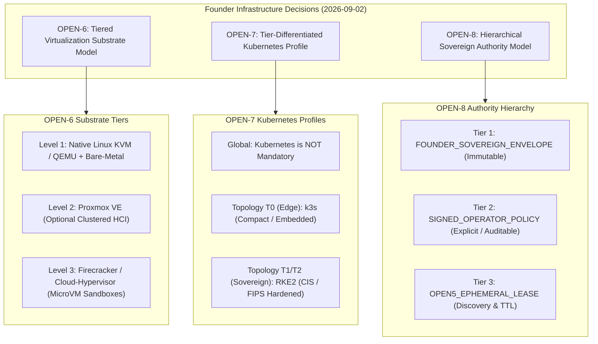
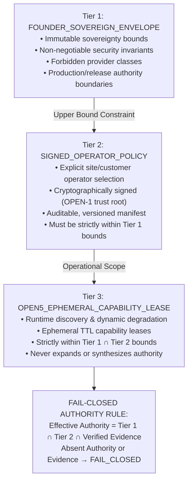

# FOUNDER DECISION PACKET: ACCEPTANCE OF SOVEREIGN INFRASTRUCTURE ARCHITECTURE STANDARDS (OPEN-6, OPEN-7, OPEN-8)

- **Status**: `DECIDED — ACCEPTED WITH BOUNDED SEMANTICS` (Founder, 2026-09-02). This packet records a Founder policy decision.
- **Authority**: **FOUNDER (CYBRIK Platform Architect & Project Lead)**
- **Decision Date**: **2026-09-02**
- **Recorded**: 2026-09-02, transcribed under explicit Founder directive by an AI agent acting solely as recording agent. No Founder signature, cryptographic signature, or acceptance receipt is synthesized or implied; the Git commit containing this file is its durable identity.
- **Scope**: `ARCHITECTURE_GOVERNANCE_ONLY`
- **Preceding Acceptance Packets**:
  - [`FOUNDER-DECISION-PACKET-DEPLOYMENT-PRIORITY-2026-08-23.md`](FOUNDER-DECISION-PACKET-DEPLOYMENT-PRIORITY-2026-08-23.md) ([ADR-0015](ADR-0015-deployment-priority-sovereignty-and-provider-neutral-boundary.md))
  - [`FOUNDER-DECISION-PACKET-PLATFORM-CONTRACT-2026-08-24.md`](FOUNDER-DECISION-PACKET-PLATFORM-CONTRACT-2026-08-24.md)
  - [`FOUNDER-DECISION-PACKET-OPEN-1-OPEN-2-OPEN-5-ACCEPTANCE-2026-08-29.md`](FOUNDER-DECISION-PACKET-OPEN-1-OPEN-2-OPEN-5-ACCEPTANCE-2026-08-29.md)
  - [`FOUNDER-DECISION-PACKET-OPEN-1-OPEN-2-OPEN-5-EDITORIAL-AND-SEMANTIC-RECONCILIATION-2026-09-01.md`](FOUNDER-DECISION-PACKET-OPEN-1-OPEN-2-OPEN-5-EDITORIAL-AND-SEMANTIC-RECONCILIATION-2026-09-01.md)
- **Supporting Evidence**: OPEN-6 Virtualization Substrate Decision Evidence Synthesis (ADR Decision Sprint 2026-09)
- **Release Impact**: None. `NEW_RC_SUBJECT_REQUIRED = YES`, `RC1_TAGS = IMMUTABLE`.
- **Production Authority**: `CLOSED` (`PRODUCTION_DEPLOYED = NO`).

---

## 1. Recorded Founder Decisions & Bounded Semantics

The Founder formally **ACCEPTS** and records the resolution of open architectural selection items **OPEN-6**, **OPEN-7**, and **OPEN-8** under strict, bounded **Architecture Governance Authority** within the CYBRIK Suite platform ecosystem:

---

### 1.1 OPEN-6: Tiered Sovereign Virtualization Substrate Model

**Formal Designation**: `TIERED_SOVEREIGN_VIRTUALIZATION_SUBSTRATE_MODEL`

The Founder resolves `OPEN-6` by establishing a tiered, provider-neutral virtualization substrate architecture:

1. **Level 1 — Base Compute & Canonical Virtualization**:
   - **Linux Native KVM / QEMU**: Designates upstream Linux KVM/QEMU as the primary canonical virtualization standard wherever full virtual machines are required. Delivers zero-licensing mainline kernel support, hardware-assisted confidential computing (AMD SEV-SNP, Intel TDX), and direct PCIe/vGPU passthrough for Cyber AI inference workloads.
   - **Bare-Metal Linux Host Execution**: Establishes direct host containerization (cgroups v2, namespaces, Linux Security Modules) as a first-class supported compute profile wherever direct hardware access, ultra-low latency, or zero hypervisor memory taxation is required.

2. **Level 2 — On-Premise Management & Clustered Hyperconverged Infrastructure**:
   - **Proxmox Virtual Environment (PVE)**: Accepted as an **optional supported HCI and management profile** for turnkey on-premise appliances and clustered private datacenter deployments (providing Ceph clustered storage, ZFS pools, and Proxmox Backup Server integration).
   - **Explicit Non-Dependency Boundary**: Proxmox VE is **NOT** a mandatory platform requirement, is **NOT** bundled into product core code, and operates strictly behind provider-neutral contract adapters.

3. **Level 3 — High-Density Ephemeral Sandboxing**:
   - **AWS Firecracker & Cloud-Hypervisor**: Accepted as **optional microVM sandbox adapters** for high-density, sub-100ms ephemeral agent execution and untrusted security tool isolation.
   - **Explicit Scope**: MicroVM runtimes are **NOT** universal platform requirements and remain adapter-scoped under the core-vs-adapter governance boundary ([ADR-0015](ADR-0015-deployment-priority-sovereignty-and-provider-neutral-boundary.md) §5.1).

4. **Non-Goals & Invariants**:
   - Proxmox VE is **NOT** mandatory everywhere;
   - Virtual machines are **NOT** mandatory where bare metal is sufficient;
   - No public cloud virtualization stack is selected or mandated;
   - Product core code remains 100% substrate-neutral and hypervisor-agnostic.

---

### 1.2 OPEN-7: Tier-Differentiated Kubernetes Profile

**Formal Designation**: `TIER_DIFFERENTIATED_KUBERNETES_PROFILE`

The Founder resolves `OPEN-7` by defining a deployment-topology-aligned Kubernetes distribution model:

1. **Global Architecture Invariant**:
   - **Kubernetes is NOT a global mandatory platform requirement**. Lightweight single-node deployments, edge appliances, and standalone container compositions that do not require distributed container orchestration remain fully supported first-class profiles.

2. **Topology T0 (Edge / Local Appliance)**:
   - Where distributed container orchestration is explicitly required by the deployment profile, the preferred lightweight distribution is **`k3s`** (compact single binary, minimal memory footprint, offline installation support, embedded SQLite/etcd).
   - **Explicit Constraint**: `k3s` is **NOT** mandated if the T0 deployment profile operates via direct container runtimes without Kubernetes.

3. **Topology T1 & T2 (Sovereign Enterprise & Private Cloud)**:
   - Where Kubernetes is selected for clustered enterprise or private cloud deployments, the primary standard distribution is **`RKE2`** (Rancher Kubernetes Engine Government).
   - Selected for strict compliance alignment: DISA STIG / CIS hardening benchmarks, FIPS 140-2 cryptographic module support, air-gapped container image bundling, offline registry workflows, and cryptographically signed release artifacts.

4. **Optional Compatibility & Non-Goals (Explicit Bounded Semantics)**:
   - `UPSTREAM_KUBERNETES_COMPATIBILITY = DESIRABLE`
   - `UPSTREAM_KUBEADM = NOT_PRIMARY_SELECTED_DISTRIBUTION`
   - `TALOS_LINUX = NOT_SELECTED_AS_GLOBAL_STANDARD`
   - `OPENSHIFT = NOT_SELECTED_AS_GLOBAL_STANDARD`
   - `MICROK8S = NOT_SELECTED_AS_GLOBAL_STANDARD`
   - `FOREIGN_PUBLIC_CLOUD_MANAGED_CONTROL_PLANES = DEFERRED_OPTIONAL_PROFILE`

---

### 1.3 OPEN-8: Hierarchical Sovereign Authority Model

**Formal Designation**: `HIERARCHICAL_SOVEREIGN_AUTHORITY_MODEL`

The Founder resolves `OPEN-8` by rejecting ambiguous "hybrid cloud" paradigms and establishing a three-tier hierarchical authority structure governing infrastructure, provider, and runtime capability selection:

1. **Tier 1 — `FOUNDER_SOVEREIGN_ENVELOPE` (Immutable Upper Constraint)**:
   - Establishes global, non-negotiable sovereignty invariants: data sovereignty, air-gapped lifecycle compliance, prohibition of non-sovereign telemetry/cloud call-homes, and exclusive Founder authority over production deployment and official release candidate generation.
   - **Monotone Constraint**: Lower tiers can narrow or restrict authority, but cannot widen, bypass, or override Tier 1 constraints under any circumstance.

2. **Tier 2 — `OPERATOR_SIGNED_DEPLOYMENT_POLICY` (Explicit Local Selection)**:
   - Grants designated on-premise, enterprise, or site operators the explicit authority to select and configure infrastructure providers, hypervisors (KVM, Proxmox, bare-metal), Kubernetes distributions (k3s, RKE2, none), and storage backends strictly within Tier 1 boundaries.
   - Must be explicit, cryptographically signed, versioned, and verifiable using the [OPEN-1](../../contracts/lifecycle/CYBRIK-OFFLINE-INSTALL-UPDATE-V1-SPECIFICATION.md) operator trust-root infrastructure.

3. **Tier 3 — `OPEN5_EPHEMERAL_CAPABILITY_LEASE` (Dynamic Runtime Negotiation)**:
   - Operates strictly under [OPEN-5](../../contracts/platform/CYBRIK-PROVIDER-CAPABILITY-NEGOTIATION-V1-SPECIFICATION.md) protocol semantics at runtime. Discovers host compute, virtualization, storage, and accelerator capabilities, dynamically leases active capabilities, or transitions to graceful degradation.
   - Operates with bounded ephemeral Time-To-Live (TTL); **never synthesizes new authority** or overrides Tier 1 / Tier 2 constraints.

4. **Fail-Closed Authority Resolution Rule**:
   $$\text{Effective Permission} = \text{FOUNDER\_ENVELOPE} \cap \text{SIGNED\_OPERATOR\_POLICY} \cap \text{CURRENT\_VERIFIED\_CAPABILITY\_EVIDENCE}$$
   - If any required authority component or cryptographic evidence is absent, expired, unverified, or conflicting, the system must **`FAIL_CLOSED`** (`TERMINAL_REJECTED` / `REJECTED_FAIL_CLOSED`).

---

## 2. Deployment Priority & Provider Neutrality Alignment

1. **Deployment Priority Hierarchy ([ADR-0015](ADR-0015-deployment-priority-sovereignty-and-provider-neutral-boundary.md) §6)**:
   - **Priority 1 (P1)**: On-Premise Sovereign Compute & Storage (Bare-Metal, Proxmox VE, KVM);
   - **Priority 2 (P2)**: Sovereign Private Cloud Datacenters (Clustered KVM/Ceph, RKE2);
   - **Priority 3 (P3)**: Sovereign Controlled Cross-Domain / Optional Hybrid Environments;
   - **Foreign Public Cloud**: Classified as **Deferred Optional** downstream adapters only.

2. **Strict Provider Neutrality**:
   - Product core code across all CYBRIK Suite, Cyber AI, SOC Command Center, and Security Tool Fabric repositories remains strictly provider-neutral. Hypervisor, Kubernetes, and storage interactions are mediated exclusively through versioned contract adapters ([OPEN-1](../../contracts/lifecycle/CYBRIK-OFFLINE-INSTALL-UPDATE-V1-SPECIFICATION.md), [OPEN-2](../../contracts/storage/CYBRIK-S3-COMPATIBILITY-SUBSET-V1-SPECIFICATION.md), [OPEN-5](../../contracts/platform/CYBRIK-PROVIDER-CAPABILITY-NEGOTIATION-V1-SPECIFICATION.md)).

---

## 3. Acceptance Scope & Explicit Non-Claims

- **Authority Scope**: `ARCHITECTURE_GOVERNANCE_ONLY`
- **Implementation Authority**: Confined strictly to architecture standard definition and contract specification governance. Implementation in product repositories requires separate, repository-governed review gates.
- **Explicit Non-Claims**:
  - `PRODUCTION_DEPLOYMENT_AUTHORITY = CLOSED`
  - `PRODUCTION_DEPLOYED = NO`
  - `RELEASE_CANDIDATE_TAG = NOT_GRANTED` (RC1 tags remain immutable)
  - `FINAL_RELEASE_TAG = NOT_GRANTED`
  - `LEGAL_INTERPRETATION = NOT_GRANTED` (`OPEN-9` is explicitly `LEGAL_REVIEW_REQUIRED`, governed under a separate legal track)

---

## 4. Open Item Master Registry Post-Decision States

| Open Item ID | Title | Status Post-Packet | Resolution Artifact / Reference |
| :--- | :--- | :--- | :--- |
| `OPEN-1` | `OFFLINE_INSTALL_UPDATE_CONTRACT` | **`RESOLVED_BY_FOUNDER_ACCEPTED_CONTRACT`** | `contracts/lifecycle/CYBRIK-OFFLINE-INSTALL-UPDATE-V1-SPECIFICATION.md` |
| `OPEN-2` | `S3_COMPATIBILITY_MINIMUM_CONTRACT` | **`RESOLVED_BY_FOUNDER_ACCEPTED_CONTRACT`** | `contracts/storage/CYBRIK-S3-COMPATIBILITY-SUBSET-V1-SPECIFICATION.md` |
| `OPEN-3` | `AI_DNS_TOCTOU_EGRESS_GUARD` | `OPEN / UNAFFECTED_BY_THIS_PACKET` | Separately tracked AI model-seam guard |
| `OPEN-4` | `CANONICAL_T0_T1_T2_SEMANTICS` | **`RESOLVED`** | Platform Contract v1 Proposal Acceptance |
| `OPEN-5` | `OPTIONAL_PROVIDER_CAPABILITY_NEGOTIATION` | **`RESOLVED_BY_FOUNDER_ACCEPTED_CONTRACT`** | `contracts/platform/CYBRIK-PROVIDER-CAPABILITY-NEGOTIATION-V1-SPECIFICATION.md` |
| `OPEN-6` | `VIRTUALIZATION_SUBSTRATE_SELECTION` | **`RESOLVED_BY_FOUNDER_ACCEPTED_DECISION`** | `TIERED_SOVEREIGN_VIRTUALIZATION_SUBSTRATE_MODEL` (This Packet) |
| `OPEN-7` | `KUBERNETES_DISTRIBUTION_SELECTION` | **`RESOLVED_BY_FOUNDER_ACCEPTED_DECISION`** | `TIER_DIFFERENTIATED_KUBERNETES_PROFILE` (This Packet) |
| `OPEN-8` | `PROVIDER_SELECTION_AUTHORITY_MODEL` | **`RESOLVED_BY_FOUNDER_ACCEPTED_DECISION`** | `HIERARCHICAL_SOVEREIGN_AUTHORITY_MODEL` (This Packet) |
| `OPEN-9` | `LEGAL_INTERPRETATION_OF_DEPLOYMENT_LOCATION` | `OPEN / LEGAL_REVIEW_REQUIRED` | Separate legal track, governed separately from architecture |
| `OPEN-10` | `PLATFORM_CONTRACT_SLOT_SEMANTICS` | **`RESOLVED`** | Platform Contract v1 Proposal Acceptance |
| `OPEN-11` | `PRODUCT_CORE_MODULE_VS_ADAPTER_BOUNDARY` | `OPEN / PER_MODULE_CLASSIFICATION_REMAINS_OPEN` | Definition resolved; per-module pass ongoing |

---

## 5. Next Action Sequence

`RECORD_DECISION_PACKET -> UPDATE_ADR_CATALOG -> RECONCILE_CONTRACT_VALIDATORS -> VERIFY_SUITE_TESTS`
