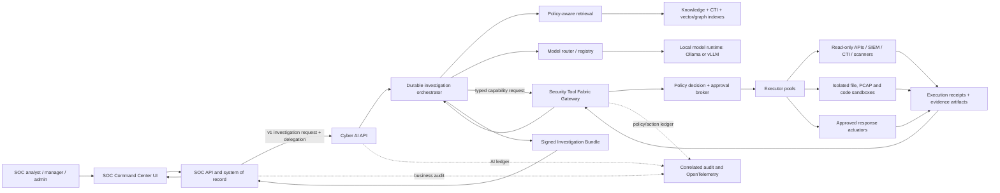

# Reference Architecture — CYBRIK SOC, Cyber AI and Security Tool Fabric

- **Ngày:** 2026-07-22
- **Trạng thái:** [PROPOSAL]
- **Kiểu kiến trúc:** ba bounded product, versioned contracts, ít deployable trong giai đoạn đầu
- **Nguồn hiện trạng:** `cybrik-soc-command-center:docs/architecture/ARCHITECTURE-OVERVIEW-2026-07.md`

## 1. Architectural drivers

1. Local/on-prem/air-gapped là deployment mode hạng nhất.
2. SOC V2 không bị gián đoạn khi AI Platform hoặc Tool Fabric lỗi/tắt.
3. Tenant, user authority, classification và purpose đi xuyên mọi request/event.
4. Model không có credential, direct database access, unrestricted query hoặc shell.
5. Mọi claim có evidence; mọi side effect có policy decision, approval và receipt.
6. Mọi artifact có version, digest, license, provenance và offline verification.
7. REST/OpenAPI là compatibility baseline; async event và MCP là extension, không bắt buộc
   mọi khách hàng phải vận hành đầy đủ ngay ngày đầu.
8. Một founder không vận hành hàng chục service: mỗi sản phẩm bắt đầu là modular service với tối
   đa hai process chính, chỉ tách thêm sau khi đo bottleneck/isolation need.

## 2. Product ownership

| Capability/data | SOC Command Center | Cyber AI Platform | Security Tool Fabric |
|---|---:|---:|---:|
| User/tenant/role/session | **Owner** | Consumer qua delegation | Consumer qua delegation |
| Alert/case/asset/IOC truth | **Owner** | Read scoped snapshot | Không sở hữu |
| Event ingest/lake/search/SIEM detection | **Owner product/data plane** | Scoped consumer/tool requester | Tool adapter/executor, không sở hữu SIEM truth |
| Analyst UI/workbench | **Owner** | Không có UI analyst riêng | Không có UI analyst riêng |
| Model runtime/model registry | Client | **Owner** | Không sở hữu |
| RAG/CTI knowledge/index | **Owner IOC operational truth** | **Owner** acquisition/knowledge plane | Tool adapter tới external CTI |
| Investigation graph/bundle | Link + accepted copy | **Owner** generation/version | Cung cấp receipts/artifacts |
| Agent state/planning | Không | **Owner** | Không |
| Tool registry/capability schema | SOC capabilities published | Consumer | **Owner** |
| Policy/approval/execution | SOC hiển thị approval và user decision | Requester, không tự quyết | **Owner** decision + execution receipt |
| Sandbox/file/PCAP execution | Case links/artifact metadata | Requester/analyser | **Owner** isolated execution |
| Audit | **Owner business audit** | AI decision ledger | Tool/action ledger |
| Evaluation | Feedback source | **Owner AI/e2e eval** | Tool conformance/security eval |
| Deployment/update | Suite operator view | Signed component bundle | Signed component/tool bundle |

### 2.1 Quy tắc nguồn sự thật

- SOC sở hữu hành vi SIEM/Data Plane, detection và operational IOC dù dùng Kafka/OpenSearch/Wazuh/
  Suricata làm engine; engine giữ nguyên identity/license và không được gọi là IP CYBRIK.
- Cyber AI sở hữu CTI acquisition/normalization/knowledge/correlation; chỉ publish IOC/intelligence
  đã qua policy về operational registry của SOC, không tạo một IOC truth cạnh tranh.
- Tool Fabric sở hữu sandbox control plane, isolation profile và evidence receipt; container,
  microVM và analysis engine bên dưới là replaceable implementation.
- Cyber AI không tự đóng alert, sửa case hoặc tạo asset truth.
- Tool Fabric không tự hiểu “incident”; nó hiểu capability, subject, target, risk, policy,
  approval và receipt.
- SOC nhận output AI dưới dạng proposal/draft. Khi analyst chấp nhận, SOC tạo mutation bằng
  credential và RBAC của analyst, lưu liên kết tới `investigation_id`/`receipt_id`.
- Audit ba tầng không thay thế nhau; cùng `trace_id`, `investigation_id` và `action_id` để
  đối chiếu.

## 3. Repository and deployment shape

### 3.1 Repository đề xuất

| Repository | Nội dung |
|---|---|
| `cybrik-soc-command-center` | Sản phẩm hiện hữu; compatibility facade và analyst UX |
| `cybrik-cyber-ai-platform` | AI API, worker, orchestration, RAG/CTI, eval, model adapters |
| `cybrik-security-tool-fabric` | Gateway, registry, policy, approvals, executor/sandbox adapters |
| `cybrik-contracts` | OpenAPI/AsyncAPI/JSON Schema/protobuf fixtures, generated SDK và compatibility tests; **không phải sản phẩm thứ tư** |

Không dùng Git submodule cho runtime dependency. Mỗi release pin phiên bản package/schema
`cybrik-contracts`; consumer-driven contract tests phát hiện breaking change.

### 3.2 Process topology giai đoạn đầu

- **Cyber AI:** `ai-api` + `ai-worker`; model runtime (Ollama/vLLM) là engine độc lập.
- **Tool Fabric:** `fabric-api` + `fabric-worker`; sandbox workers tách theo isolation profile.
- **SOC:** giữ process hiện hành; background task tải nặng dần chuyển ra worker theo Data Plane V2.
- **PostgreSQL:** database/schema tách theo sản phẩm; tuyệt đối không join cross-product database.
- **Kafka:** optional ở T0, required ở T1/T2 cho async jobs/events; transactional outbox giữ parity.

## 4. Logical architecture



## 5. CYBRIK SOC Command Center

### 5.1 Giữ nguyên

**[FACT–SOC]** Các module hiện tại tiếp tục sở hữu:

- identity/tenant/RBAC/RLS/audit;
- alert, case, asset, IOC và user preferences;
- canonical event/alert mapping và provenance;
- analyst/manager/executive UI;
- approval user experience và business workflow;
- existing `/api/v1/copilot/ask` compatibility endpoint.

Symbols hiện hành: `main.py::create_app`, `copilot/api.py::ask`,
`copilot/gateway.py::run_chat`, `copilot/models.py::CopilotAudit`.

### 5.2 Thành phần cần thêm nhưng không đổi ownership

- `AIPlatformClient` implementation sau protocol hiện có;
- feature flag: `disabled | embedded | shadow_remote | remote`;
- scoped context export API, không cho AI truy cập database trực tiếp;
- Investigation Bundle viewer trong alert/case;
- approval inbox gọi Tool Fabric nhưng xác thực actor ở SOC;
- feedback/verdict capture chuẩn hoá cho evaluation.

### 5.3 Compatibility rule

`POST /api/v1/copilot/ask` không bị xóa trong migration. Khi `remote`:

1. SOC validate `copilot:use` và tenant như hiện nay;
2. SOC tạo scoped investigation request;
3. Cyber AI trả `accepted` hoặc result;
4. SOC map result về `AskResponse` cũ cho task summary/triage;
5. advanced result hiển thị qua Investigation Bundle component mới.

Nếu Cyber AI unavailable, SOC trả degraded state có kiểm soát; alert/case vẫn hoạt động.

## 6. CYBRIK Cyber AI Platform

### 6.1 Modules

| Module | Trách nhiệm |
|---|---|
| AI Gateway | Auth delegation, quota, request validation, tenant/purpose propagation |
| Model Router | Chọn model theo task/hardware/policy; OpenAI-compatible adapter; timeout/circuit breaker |
| Model Registry | Model card, digest, license, hardware profile, eval status, rollout/rollback |
| Prompt Registry | Prompt/template/schema version, review status và tests; không hard-code phân tán |
| Retrieval Gateway | Hybrid lexical/vector/graph retrieval; policy/tenant/classification filter trước ranking |
| CTI Pipeline | STIX/TAXII ingest, dedup, confidence/marking/expiry, signed offline bundles |
| Investigation Graph | Entity/evidence/hypothesis/timeline graph per investigation |
| Durable Orchestrator | State machine, checkpoint, budget, cancellation, retry, compensation |
| Evidence Synthesizer | Claim-to-evidence mapping, contradiction detection, abstention |
| Evaluation Service | Offline golden sets, online shadow metrics, regression comparison |
| AI Ledger | Immutable run metadata, hashes, model/prompt/retrieval/tool versions |

### 6.2 Orchestration rules

- LLM đề xuất plan; deterministic controller validate plan và chọn allowed transition.
- Mỗi node có typed input/output schema, timeout, retry budget và maximum fan-out.
- Không có unbounded “think/reflect until done”.
- Tool call chỉ qua Fabric; retrieval chỉ qua Retrieval Gateway.
- State checkpoint sau mỗi evidence/tool step; cancellation không làm mất receipts.
- Budget gồm time, tokens, retrieved bytes, tool calls, network egress và monetary class.
- Kết thúc bằng `completed`, `partial`, `abstained`, `denied`, `cancelled` hoặc `failed`;
  không ép model phải đưa ra verdict khi evidence thiếu.

### 6.3 RAG/knowledge architecture

```text
Source intake
  -> quarantine + signature/hash/license check
  -> parser/normalizer
  -> source trust + marking + tenant/collection policy
  -> chunk/entity extraction
  -> lexical index + vector index + CTI graph
  -> evaluation canary
  -> publish index version
```

Ban đầu dùng PostgreSQL + pgvector cho metadata/vector và full-text mức vừa. Chỉ chuyển vector/
graph workload sang OpenSearch hoặc graph engine riêng khi đo được giới hạn. Raw alert/log không
được copy hàng loạt vào vector store; truy vấn trực tiếp qua scoped tool tránh nhân bản dữ liệu
nhạy cảm.

## 7. CYBRIK Security Tool Fabric

### 7.1 Modules

| Module | Trách nhiệm |
|---|---|
| Capability Registry | Tool manifest, version, publisher, signature, risk class, schemas |
| Gateway | REST/MCP discovery/invocation, delegation validation, idempotency |
| Policy Decision Point | RBAC/ABAC, tenant, purpose, target class, risk, time, environment |
| Approval Broker | Create/expire/cancel approval; four-eyes; immutable decision receipt |
| Credential Broker | Resolve `secret_ref`, issue short-lived target credential; never return to model |
| Egress Broker | DNS/IP/domain/protocol allowlist, proxy, rate/byte limits, no redirect by default |
| Execution Scheduler | Queue, concurrency, timeout, cancellation, retry, dedup |
| Executor Pools | Read API, network analysis, file analysis, active scan, response actuator |
| Artifact Store | Immutable input/output, hash, malware classification, retention/legal hold |
| Receipt Ledger | Request, resolved params, policy, approval, executor, output digest, side effect |
| Kill Switch | Global, tenant, tool, target and action kill switches; fail closed |

### 7.2 Capability risk classes

| Class | Ví dụ | Default | Isolation/approval |
|---|---|---|---|
| R0 — read metadata | get alert, asset, IOC, metrics | Allow theo scope | API worker; no approval |
| R1 — analyse artifact | parse PCAP, extract strings, YARA scan | Allow theo case | No-network sandbox; quota |
| R2 — active observation | query live SIEM, DNS/WHOIS nội bộ, active scan | Conditional | Egress allowlist; optional approval |
| R3 — reversible mutation | add temporary block, isolate endpoint, create ticket | Deny by default | Named approver, TTL/rollback required |
| R4 — destructive/irreversible | delete, wipe, permanent block broad scope | Hard deny trong 1.x | Không cung cấp cho agent |

Risk class chỉ là upper bound. Policy có thể nâng yêu cầu theo tenant/target/classification nhưng
không hạ dưới hard safety rule của product.

### 7.3 Sandbox profiles

- **S0 API-only:** không chạy input không tin cậy.
- **S1 restricted container:** read-only rootfs, non-root, seccomp/AppArmor, no network, CPU/RAM/
  time/output caps; dành cho parser/scanner đã review.
- **S2 microVM:** file/binary/code không tin cậy, disposable filesystem, no host mounts, controlled
  artifact channel; dùng cho detonation/complex analysis.
- **S3 controlled network lab:** PCAP replay/active observation trong network namespace tách,
  egress qua broker; không có route tới management/production network.
- **S4 response executor:** không nhận file; chỉ gọi typed vendor API với credential ngắn hạn,
  policy+approval+rollback.

Không chạy raw file/PCAP trong AI process hoặc SOC API process.

## 8. Shared identity and authorization

### 8.1 Delegation token tối thiểu

Claims:

- `iss`, `sub`, `aud`, `iat`, `nbf`, `exp`, `jti`;
- `tenant_id`, `actor_id`, `actor_type`;
- `roles` hoặc resolved `capabilities`;
- `purpose`, `case_id`, `alert_ids`/resource scope;
- `clearance`, `data_marking`;
- `investigation_id`, `trace_id`;
- `approval_id` khi thực thi hành động đã duyệt.

Token TTL đề xuất 2–5 phút, audience đúng một service. Không log token; chỉ log `jti` hash.
Service-to-service dùng mTLS/workload identity. Tool backend nhận credential do Credential Broker
cấp, không nhận delegation token nguyên bản.

### 8.2 Tenant enforcement

1. SOC kiểm quyền business.
2. Cyber AI validate audience/scope và filter retrieval.
3. Tool Fabric evaluate tenant/purpose/target/action.
4. Mỗi database/object prefix/index có tenant boundary riêng.
5. Audit test bắt buộc kiểm cross-tenant ở API, async event, retrieval cache và artifacts.

## 9. Core data flows

### 9.1 Alert-to-Investigation

```text
Analyst/SOC trigger
  -> SOC freezes scoped context snapshot + digest
  -> Cyber AI creates investigation and initial hypotheses
  -> retrieval gets CTI/runbook/CVE with policy filters
  -> orchestrator requests R0/R1/R2 tools through Fabric
  -> Fabric returns signed receipts/artifacts
  -> AI updates graph, tests contradictions, marks missing evidence
  -> bundle generated with claim-level citations
  -> SOC displays proposal; analyst accepts/edits/rejects
  -> SOC writes case/alert mutation as the human actor
  -> feedback goes to evaluation dataset after policy/redaction
```

### 9.2 Approved response

```text
AI proposes typed action
  -> Fabric dry-run resolves exact target and parameters
  -> policy returns REQUIRE_APPROVAL
  -> SOC shows impact, evidence, expiry and rollback
  -> authorized second actor approves
  -> Fabric re-evaluates policy and target freshness
  -> credential broker issues short-lived credential
  -> response executor performs action
  -> receipt + verification + rollback handle
  -> SOC timeline and all ledgers correlate by action_id
```

Approval không “cache vĩnh viễn”: thay đổi target, parameters, tool version hoặc policy digest làm
approval cũ mất hiệu lực.

### 9.3 Detection engineering

```text
Investigation finding
  -> AI produces typed detection candidate + rationale/evidence
  -> compiler/linter
  -> corpus/PCAP/log replay in sandbox
  -> coverage + FP/noise + performance report
  -> peer/four-eyes approval
  -> signed content package
  -> staged deploy/canary
  -> monitor + rollback
```

## 10. Deployment tiers

| Tier | Mục đích | Topology | Cam kết |
|---|---|---|---|
| T0 Developer/POC | Founder, demo, small lab | Docker Compose, one host, Ollama, Postgres, optional Kafka | Không HA; synthetic/non-sensitive data |
| T1 Enterprise | Pilot và production vừa | 3+ nodes hoặc conformant Kubernetes, vLLM GPU, HA Postgres/Kafka/object store | Backup/restore, rolling upgrade, SLO, tenant isolation |
| T2 Sovereign/Air-gap | Government/critical environment | Private registry, offline update station, AI enclave, sandbox zone, optional diode | No phone-home, signed bundles, offline verification, separated trust zones |

Mọi tier dùng cùng contract và feature semantics. T0 không được có “mock behavior” mà T1/T2
không có; chỉ khác availability/performance/isolation strength được công bố rõ.

## 11. Technology baseline

**[PROPOSAL]** Tận dụng năng lực hiện hữu, giảm số công nghệ:

- Python + FastAPI + Pydantic cho API/worker hai sản phẩm mới;
- PostgreSQL cho metadata/policy/audit/eval; pgvector giai đoạn đầu;
- Kafka KRaft cho async bus ở T1/T2, theo `cybrik-soc-command-center:docs/architecture/DATA-PLANE-V2.md`;
- OpenSearch + Parquet/S3-compatible object store cho event/artifact scale;
- Ollama dev, vLLM production, API OpenAI-compatible;
- OpenTelemetry cho trace/metric/log;
- OCI images + signed offline bundles;
- JSON Schema/OpenAPI/AsyncAPI là source of truth contract.

Không chọn agent framework làm lõi contract. Có thể dùng library trong implementation nhưng state,
policy, evidence và receipt phải là domain model của CYBRIK.

## 12. Migration từ AI Copilot hiện tại

### 12.1 Có thể tái sử dụng

- `LLMClient` protocol và `OpenAICompatClient` làm mẫu adapter;
- `validate_llm_base_url` và internal-host allowlist làm security regression seed;
- `Tool`/`ToolRegistry`/`validate_arguments` làm đầu vào thiết kế capability schema;
- `SYSTEM_PROMPT`, delimiter neutralization và injection tests làm eval corpus;
- `CopilotAudit`, citations và `disposition` làm compatibility data mapping;
- shadow-suggest pattern làm cơ chế online evaluation ban đầu.

### 12.2 Cần chuyển hoặc viết lại

- Model routing/prompt registry/RAG/orchestration chuyển sang Cyber AI;
- tool registry/policy/credential/sandbox chuyển sang Tool Fabric;
- direct SQL trong `_get_alert` phải thay bằng SOC scoped API/capability;
- audit JSON hiện tại nâng thành versioned ledger + artifact digests;
- in-process background orchestration thay bằng durable async jobs;
- một `SYSTEM_PROMPT` lớn tách thành versioned task policies + structured schemas;
- SOAR draft seam phải đi qua cùng capability/approval model, không là exception lâu dài.

### 12.3 Feature flags chuyển đổi

| Mode | Hành vi |
|---|---|
| `disabled` | Ẩn advanced AI; SOC không phụ thuộc AI |
| `embedded` | Gateway hiện tại chạy local; compatibility baseline |
| `shadow_remote` | Gateway hiện tại trả kết quả; Cyber AI chạy ngầm để so sánh, không hiển thị |
| `remote` | Cyber AI là provider chính; fallback policy cấu hình rõ, không fallback im lặng |

## 13. Failure and degraded modes

| Failure | Hành vi bắt buộc |
|---|---|
| Model runtime down | Investigation `partial/failed`; SOC core vẫn chạy; không mất request |
| Retrieval unavailable | AI abstain hoặc chỉ dùng scoped evidence đã có; gắn degraded reason |
| Fabric unavailable | Không tool side effect; investigation chờ/retry có budget |
| Approval service unavailable | Fail closed; không thực thi |
| Audit/receipt store unavailable | Hành động R2/R3 fail closed; R0 có thể degrade theo policy |
| Event bus lag | Backpressure, no drop, visible lag/SLO; outbox replay |
| Sandbox timeout | Kill disposable workload, preserve partial logs/digests |
| Policy version change mid-run | Re-evaluate trước action; old approval invalid nếu material change |
| Cross-tenant mismatch | Deny + high-severity security audit, không tiết lộ resource existence |

## 14. ADR bắt buộc trước implementation

1. ADR-AI-001: product/repository boundaries và data ownership.
2. ADR-AI-002: Investigation Bundle/Graph schema và retention.
3. ADR-AI-003: durable orchestration/state machine/outbox.
4. ADR-AI-004: model/prompt registry, rollout và AI-BOM.
5. ADR-AI-005: policy-aware retrieval và source trust.
6. ADR-FAB-001: capability manifest/risk class/policy decision.
7. ADR-FAB-002: delegation/workload identity/credential broker.
8. ADR-FAB-003: sandbox isolation profiles và egress broker.
9. ADR-FAB-004: approval freshness, execution receipt và kill switch.
10. ADR-SUITE-001: contract versioning, feature flags và migration compatibility.
