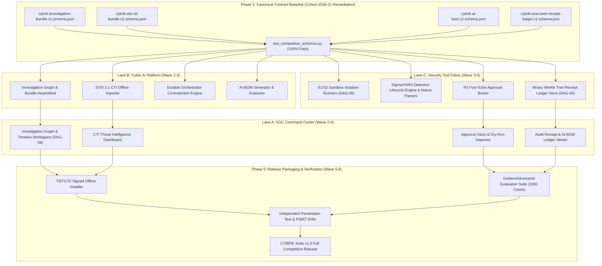

# 2026 Canonical Capability Reconciliation Matrix

- **Document Version:** 1.0.0
- **Effective Date:** 2026-09-04
- **Classification:** CYBRIK Platform Architecture & Strategy Contract (Candidate Proposal)
- **Target Release:** CYBRIK Suite 2026 Full Competitive Release (Feature Complete 2026-11-15, Release 2026-12-31)
- **Governance Status:** `PROPOSED CANDIDATE RECONCILIATION DOCUMENT (COHORT 2026-01)` — Under active development and audit remediation, NOT accepted suite truth or final GA authority.

---

> [!IMPORTANT]
> **Governance Notice & Architectural Truthfulness:**
> This document is a **PROPOSED CANDIDATE RECONCILIATION DOCUMENT (COHORT 2026-01)** authored under active development and audit remediation. It does **NOT** represent accepted suite truth, runtime execution authority, or final GA production authority. All capability statuses, runtime deployment modes, and verification methods documented below reflect the factual remediation baseline as of Cohort 2026-01.

---

## 1. Executive Context & Invariants

This matrix establishes the authoritative, cross-product reconciliation for the **10 Canonical Capability Pillars** defined in [`docs/strategy/06-ROADMAP-2026-2029.md`](docs/strategy/06-ROADMAP-2026-2029.md).

Under the CYBRIK 2026 Full Competitive Release mandate:
1. **Zero-Mock Rule:** No capability may be delivered as a mock, synthetic-only stub, or permanent "preview". Every production pathway must satisfy typed JSON Schema contracts (Draft 2020-12), end-to-end integration tests, and verifiable evidence.
2. **Triad Product Ownership:**
   - **`cybrik-soc-command-center` (Lane A):** System of Record for alerts, cases, assets, IOCs, tenant RBAC, audit viewers, and analyst investigation workspaces.
   - **`cybrik-cyber-ai-platform` (Lane B):** Local multi-runtime model execution, hybrid RAG, STIX 2.1 CTI fusion, bounded durable multi-agent orchestration, and golden/adversarial evaluation.
   - **`cybrik-security-tool-fabric` (Lane C):** Signed capability registry, REST/MCP tool gateway, S1/S2 sandbox execution, credential/egress brokering, four-eyes approval engine, and immutable execution receipt ledgers.
   - **`cybrik-suite` (Lane D / Meta):** Vendor-neutral contracts, integration test harnesses, release packaging, and deployment profiles (T0/T1/T2).
3. **Competitive Parity Baseline:** Every pillar is reconciled against major enterprise platforms—Splunk Enterprise Security, Microsoft Sentinel / Security Copilot, Palo Alto Networks Cortex XSIAM, Torq Hyperautomation, and CrowdStrike Charlotte AI—specifically addressing air-gapped sovereignty, verifiable provenance, and fail-closed safety.
4. **Architectural Truthfulness & Taxonomy Invariants:**
   - **Contract Status:** Explicitly tagged as `ACCEPTED` (merged or accepted canonical contracts) or `PROPOSED` (candidate proposals in audit review).
   - **Implementation Status:** Explicitly tagged as `IN_PROGRESS (IN_AUDIT_REMEDIATION)` or `IMPLEMENTED_UNINTEGRATED`.
   - **Runtime Status:** Explicitly distinguished across `LIBRARY_ONLY`, `MOUNTED_ROUTER`, `STANDALONE_PROCESS`, or `PLANNED`.
   - **Verification Reality:** Detection engineering (Sigma/YARA/Suricata) verification is strictly grounded in internal Python syntax parsers and unit validation; native CLI binary execution (`sigma-cli`, `yara-x`, `suricata -t`) is planned for release packaging.
   - **Ledger Reality:** Tool Execution Receipt Ledger currently implements in-process SHA-256 hash chaining with Ed25519 signing; binary Merkle tree segment aggregation is planned as future DAG work (DAG-04).

---

## 2. 10 Canonical Pillars Reconciliation Matrix

| # | Canonical Pillar | Core Contract Schemas & Contract Status | Triad Repository Mapping | Implementation Status | Runtime Status | Verification Method & Evidence | Competitive Parity vs. Enterprise Closed Platforms |
|---|---|---|---|---|---|---|---|
| **1** | **Local LLM Runtime & Multi-Model Routing** | `cybrik.ai-bom.v1.schema.json` `cybrik.model-inference-request.v1.schema.json` `cybrik.model-capability.v1.schema.json` **Status:** `ACCEPTED` | `cybrik-cyber-ai-platform` `cybrik-suite` | **IMPLEMENTED_UNINTEGRATED (IN_AUDIT_REMEDIATION)** (T0/T1/T2 Runtimes: vLLM, Ollama, llama.cpp, Triton, Stub) | `MOUNTED_ROUTER` `LIBRARY_ONLY` | Adapter unit test harnesses and Draft 2020-12 schema validation (`test_stub_adapter.py`, `test_ollama_adapter.py`, `test_competitive_schemas.py`). | Targets sovereign air-gap isolation and cryptographic AI-BOM model provenance without cloud egress dependencies. |
| **2** | **Policy-Enforced RAG & Data Ingestion** | `cybrik.ai-bom.v1.schema.json` `cybrik.data-marking.v1.schema.json` `cybrik.org-scope-grant.v1.schema.json` **Status:** `ACCEPTED` | `cybrik-cyber-ai-platform` `cybrik-soc-command-center` | **IN_PROGRESS (IN_AUDIT_REMEDIATION)** (PostgreSQL + pgvector, quarantine, classification filter) | `LIBRARY_ONLY` | Marking filter tests, egress bounds, and admission harness (`test_marking.py`, `test_egress.py`, `validate-runtime-admission.test.mjs`). | Implements policy-enforced pre-ranking tenant isolation, TLP filtering, and offline knowledge pack updates. |
| **3** | **Threat Intelligence & Structured CTI** | `cybrik.stix-cti-bundle.v1.schema.json` `cybrik.data-marking.v1.schema.json` **Status:** `ACCEPTED` | `cybrik-cyber-ai-platform` `cybrik-soc-command-center` | **IN_PROGRESS (IN_AUDIT_REMEDIATION)** (STIX 2.1, ATT&CK, CVE, CISA KEV, TAXII 2.1) | `LIBRARY_ONLY` | Draft 2020-12 schema conformance and internal Python STIX parsing tests (`test_competitive_schemas.py`, offline knowledge pack importer fixtures). | Aligns with RFC-compliant STIX 2.1 specifications, CISA KEV ransomware tracking, ATT&CK technique pinning, and cryptographic citation linking. |
| **4** | **Bounded Durable Multi-Agent Orchestrator** | `cybrik.investigation-bundle.v1.schema.json` (`ACCEPTED`) `cybrik.investigation-bundle.v2.schema.json` (`PROPOSED`) `cybrik.investigation-checkpoint.v1.schema.json` (`ACCEPTED`) `cybrik.investigation-create-request.v1.schema.json` (`ACCEPTED`) | `cybrik-cyber-ai-platform` `cybrik-soc-command-center` | **IN_PROGRESS (IN_AUDIT_REMEDIATION)** (Durable state machine, checkpoints, replay, contradiction detection) | `LIBRARY_ONLY` | Durable checkpoint serialization, replay invariants, and orchestration tests (`test_orchestration_controller.py`, `test_orchestration_checkpoints.py`, `test_investigation_service.py`). | Provides deterministic checkpoint recovery, step/token resource bounds, explicit abstention semantics, and investigation graph bundles. |
| **5** | **Signed Capability Registry & MCP Gateway** | `cybrik.capability.v1.schema.json` `cybrik.tool-execution-request.v1.schema.json` `cybrik.svc-delegation-token.v1.schema.json` **Status:** `ACCEPTED` | `cybrik-security-tool-fabric` `cybrik-suite` | **IN_PROGRESS (IN_AUDIT_REMEDIATION)** (REST / MCP 2025-11-25 gateway, signed manifest, kill switches) | `MOUNTED_ROUTER` | Wire contracts, capability conformance, and SPIFFE delegation tests (`test_capability_conformance.py`, `test_wire_contracts.py`, `test_svc_delegation.py`). | Implements Model Context Protocol (MCP 2025-11-25) gateway, SPIFFE delegation tokens, and cryptographic capability kill switches. |
| **6** | **Security Investigation Tool Packs** | `cybrik.soc-get-alert-context.v1.schema.json` `cybrik.tool-execution-result.v1.schema.json` **Status:** `ACCEPTED` | `cybrik-security-tool-fabric` `cybrik-soc-command-center` | **IN_PROGRESS (IN_AUDIT_REMEDIATION)** (R0–R3 typed packs: SIEM, OpenSearch, Wazuh, IOC, CVE, PCAP) | `LIBRARY_ONLY` | Scoped alert context conformance and transport binding tests (`test_alert_context_conformance.py`, `validate-alert-context-transport.test.mjs`). | Provides scoped security query bindings, structured alert context, and stdout redaction. |
| **7** | **Isolated Analysis Sandbox** | `cybrik.execution-receipt.v1.schema.json` `cybrik.common-defs.v1.schema.json` ($defs/isolationProfile) **Status:** `ACCEPTED` | `cybrik-security-tool-fabric` | **IN_PROGRESS (IN_AUDIT_REMEDIATION)** (S0 in-memory metadata inspection active; S1/S2 container runners in DAG-05) | `PLANNED` (S0 is `LIBRARY_ONLY`) | In-memory fabric partition tests and evidence chain validation (`test_fabric_partition.py`, `test_validate_evidence_chain.py`). | Defines lightweight S1/S2 disposable execution profiles, archive decompression ratio guards, and derived artifact provenance hashes. |
| **8** | **Detection Engineering Lifecycle** | `cybrik.capability.v1.schema.json` `cybrik.investigation-bundle.v1.schema.json` **Status:** `ACCEPTED` | `cybrik-security-tool-fabric` `cybrik-soc-command-center` (Fabric control plane & SOC detection bridge) | **IN_PROGRESS (IN_AUDIT_REMEDIATION)** (Sigma, YARA, YARA-X, Suricata syntax parsing, backtest design, rollback models) | `LIBRARY_ONLY` | **Internal Python syntax parsers and unit validation** (`test_scaffold_integrity.py`, `validate-platform-contract.test.mjs`). External native CLI binary execution (`sigma-cli`, `yara-x`, `suricata -t`) is **PLANNED**. | Provides syntax validation via internal Python parsers, false-positive backtesting design, and signed rule rollback mechanisms. |
| **9** | **Controlled Action & Approval Broker** | `cybrik.approval-request.v1.schema.json` `cybrik.approval-decision.v1.schema.json` `cybrik.execution-receipt.v1.schema.json` **Status:** `ACCEPTED` | `cybrik-security-tool-fabric` `cybrik-soc-command-center` | **IN_PROGRESS (IN_AUDIT_REMEDIATION)** (R0–R3 risk tiers, four-eyes gate, credential/egress broker, A4) | `LIBRARY_ONLY` | Multi-party policy evaluation, egress brokering, and receipt integrity validation (`test_policy.py`, `test_egress.py`, `validate-receipt-integrity.test.mjs`). | Enforces R0-R3 risk tiers, multi-party four-eyes approval workflow, ephemeral credential leases, and fail-closed execution bounds. |
| **10** | **Immutable Audit, AI-BOM & Evaluation** | `cybrik.execution-receipt-ledger.v1.schema.json` `cybrik.ai-bom.v1.schema.json` `cybrik.receipt-trust-bundle.v1.schema.json` **Status:** `ACCEPTED` | `cybrik-suite` `cybrik-security-tool-fabric` `cybrik-cyber-ai-platform` | **IN_PROGRESS (IN_AUDIT_REMEDIATION)** (SHA-256 hash chaining + Ed25519 signing active; Merkle segment tree aggregation in DAG-04; AI-BOM manifest; golden/adversarial test harness) | `LIBRARY_ONLY` | **Receipt ledger currently implements in-process SHA-256 hash chaining with Ed25519 signing** (Merkle segment aggregation planned in DAG-04). Validated via `test_competitive_schemas.py`, `test_receipt_integrity.py`, `validate-receipt-trust-durability.test.mjs`. | Implements append-only hash-chained receipt ledgers with Ed25519 signatures, cryptographic replay verification, golden evaluation suites, and AI-BOM supply-chain manifests. |

---

## 3. Deep-Dive Pillar Analysis & Technical Realization

### Pillar 1: Local LLM Runtime & Multi-Model Routing
- **Architectural Seam:** Inference Transport Binding Profile ([`ADR-0011`](docs/adr/ADR-0011-inference-plane-transport-binding-profile.md)).
- **Hardware Profiles:**
  - **T0 (Developer):** Apple Silicon / Linux Workstation (32GB Unified Memory, GGUF/Ollama / llama.cpp runtime, Qwen-2.5-Coder-14B / 32B-Instruct-Q4).
  - **T1 (On-Premises Single-Node):** 1x-2x NVIDIA RTX 4090 / A6000 Ada (48-96GB VRAM, vLLM / AWQ, Qwen-2.5-72B-Instruct-AWQ).
  - **T2 (Sovereign Air-Gap Cluster):** 4x-8x NVIDIA H100/H200 NVLink (vLLM / Triton, Tensor Parallelism = 4/8, Qwen-2.5-72B / DeepSeek-V2.5).
- **AI-BOM Integration:** Pinned by `cybrik.ai-bom.v1.schema.json` capturing exact weights SHA-256 digests, SPDX license terms, runtime engine constraints, and prompt registry hashes.
- **Fail-Closed Routing:** Model routing degrades gracefully to deterministic rule-based triage when VRAM or inference latency SLOs are breached.
- **Runtime Deployment State:** Currently `MOUNTED_ROUTER` / `LIBRARY_ONLY` in `wt-cyber-ai-open3`.

### Pillar 2: Policy-Enforced RAG & Incremental Ingestion
- **Storage Substrate:** PostgreSQL 16 + pgvector with HNSW indexing and hybrid reciprocal rank fusion (BM25 + vector cosine distance).
- **Tenant & Marking Guard:** Strict pre-retrieval filtering applying `cybrik.data-marking.v1.schema.json` (TLP level, classification, purpose limitation, tenant isolation). Raw alerts are never ingested verbatim without redaction and scope binding.
- **Air-Gap Knowledge Packs:** Versioned, signed offline archives containing MITRE ATT&CK Enterprise v15+, CISA KEV catalog, and CVE vulnerability databases.
- **Runtime Deployment State:** `LIBRARY_ONLY` within platform data plane services.

### Pillar 3: Threat Intelligence & Structured CTI (STIX 2.1)
- **Unified Contract:** `cybrik.stix-cti-bundle.v1.schema.json` enforces RFC-compliant STIX 2.1 bundle formatting with rich typed extensions for:
  - MITRE ATT&CK tactics, techniques, and sub-techniques (`attack-pattern`).
  - Vulnerability definitions with CVSS v3.1 scoring and CISA KEV ransomware campaign flags (`vulnerability`).
  - Threat indicators with Sigma/YARA pattern types and validity windows (`indicator`).
  - Adversary groups, aliases, and motivations (`threat-actor`).
  - Semantic relationships and sightings (`relationship`).
- **Citation Linking:** Citations in `cybrik.investigation-bundle.v1.schema.json` bind directly to CTI indicators with SHA-256 content digests.
- **Verification Reality:** STIX bundle verification uses internal Python schema validation and unit fixtures.
- **Runtime Deployment State:** `LIBRARY_ONLY`.

### Pillar 4: Bounded Durable Multi-Agent Orchestrator
- **State Machine Architecture:** State checkpoints serialized via `cybrik.investigation-checkpoint.v1.schema.json` into PostgreSQL durable stores.
- **Specialized Roles:**
  - **Triage Agent:** Scopes alert context, queries asset inventory, checks CTI reputation.
  - **Forensic Investigation Agent:** Reconstructs attack timeline, queries SIEM logs, evaluates sandbox artifacts.
  - **Hypothesis Formulation & Contradiction Agent:** Evaluates competing hypotheses, flags counter-evidence, triggers explicit abstention when data is incomplete.
  - **Detection Engineer Agent:** Drafts Sigma/YARA candidate rules based on observed indicators.
  - **Response Planner Agent:** Formulates reversible containment proposals (R3) under strict policy approval.
- **Resource Envelope:** Guaranteed bounded execution governed by max iterations (default: 20), token budget ceilings, wall-clock timeouts, and explicit cancellation listeners.
- **Runtime Deployment State:** `LIBRARY_ONLY`.

### Pillar 5: Signed Capability Registry & REST/MCP Gateway
- **Specification Pin:** Model Context Protocol (MCP) version `2025-11-25` and OpenAPI 3.1.x.
- **Security Primitives:**
  - Every capability is registered with a cryptographic digest (`cybrik.capability.v1.schema.json`).
  - Workload identity delegation via SPIFFE IDs and signed tokens (`cybrik.svc-delegation-token.v1.schema.json`).
  - Granular emergency kill switches at global, tenant, tool, and action levels.
- **Runtime Deployment State:** `MOUNTED_ROUTER` within the Tool Fabric gateway.

### Pillar 6: Security Investigation Tool Packs
- **Canonical Tool Families:**
  - `cybrik.siem.search_events.v1`: Scoped OpenSearch/Wazuh/Elastic log search.
  - `cybrik.cti.lookup_indicator.v1`: Fast STIX 2.1 / MISP / OpenCTI reputation queries.
  - `cybrik.cve.lookup_vulnerability.v1`: CVE and CISA KEV exploit lookup.
  - `cybrik.attack.lookup_technique.v1`: MITRE ATT&CK technique and mitigation retrieval.
  - `cybrik.asset.get_identity.v1`: Scoped asset context, IP/MAC history, owner identity.
  - `cybrik.case.update_evidence.v1`: Bidirectional sync with SOC case management.
- **Runtime Deployment State:** `LIBRARY_ONLY`.

### Pillar 7: Isolated Analysis Sandbox
- **Current Realization vs. Target Architecture:**
  - **Current Implementation:** S0 pooled in-memory metadata inspection.
  - **Planned DAG Work (DAG-05):**
    - **S1 (Disposable Container):** Ephemeral Linux container, strictly zero network egress, read-only rootfs, 512MB RAM cap, 1 CPU cap, 60s timeout for static log/archive/PE analysis.
    - **S2 (Isolated Network Emulation):** Ephemeral sandbox with sinkholed DNS/HTTP for dynamic PCAP replay and network inspection.
- **Anti-Evasion & Safety:** Archive decompression recursion limits (max depth: 3), decompression ratio guards (max 100:1), and device/symlink sanitization.
- **Runtime Deployment State:** `PLANNED` (S0 is `LIBRARY_ONLY`).

### Pillar 8: Detection Engineering Lifecycle
- **End-to-End Pipeline & Verification Reality:**
  1. *Authoring:* Agent drafts Sigma, YARA, YARA-X, or Suricata rules based on investigation graph nodes.
  2. *Compilation & Syntax Parsing:* **Currently implemented via internal Python syntax parsers and unit validation** (AST validation, YAML schema checks, pattern syntax analysis). Integration with external native CLI binaries (`sigma-cli`, `yara-x`, `suricata -t`) is **PLANNED** for release packaging.
  3. *Historical Backtesting:* Replay against indexed telemetry in the data plane to calculate true positive and false positive rates.
  4. *Signing & Packaging:* Content packages cryptographically signed by the Detection Authority.
  5. *Rollback Mechanism:* Reversible state transition with zero-downtime rule deactivation.
- **Runtime Deployment State:** `LIBRARY_ONLY`.

### Pillar 9: Controlled Action & Approval Broker
- **Risk Classification:**
  - **R0 (Read-Metadata):** Scoped alert/asset lookups. Auto-approved under tenant policy.
  - **R1 (Read-Data):** SIEM log queries, file extraction. Auto-approved with rate limiting and audit logging.
  - **R2 (Active Observation):** Live host polling, port scan probe. Requires SOC policy match.
  - **R3 (Reversible Containment):** Temporary host isolation, firewall block, account lockout. Requires mandatory multi-party ("four-eyes") approval, resolved argument binding, TTL expiration, and automated rollback plan.
  - **R4 (Destructive / Irreversible):** Strictly disabled by default in all production profiles.
- **Credential & Egress Broker:** Single-use credential leases generated on-demand with 60s TTL; executors never hold permanent API keys or service tokens.
- **Runtime Deployment State:** `LIBRARY_ONLY`.

### Pillar 10: Immutable Audit, Receipt Ledger, Golden Eval & AI-BOM
- **Execution Receipt Ledger Reality:** Governed by `cybrik.execution-receipt-ledger.v1.schema.json`.
  - **Current Implementation:** In-process SHA-256 hash chaining with Ed25519 signing for sequential execution receipts, ensuring tamper-evident execution lineage.
  - **Planned DAG Work (DAG-04):** Binary Merkle tree segment aggregation and batch root sealing during release packaging and multi-tenant ledger scaling.
  - **Cryptographic Verification:** Control-plane signatures (Ed25519 / ECDSA-P256) verifying every ledger block.
  - **Structural Replay:** Allows complete independent audit of every decision and tool execution.
- **Evaluation & AI-BOM:**
  - Golden evaluation harness executing regression tests across sanitized real-world attack scenarios.
  - Adversarial injection suites verifying prompt injection resistance, data exfiltration guards, and hallucination bounds.
  - AI-BOM manifest generated with every model deployment ensuring 100% supply-chain traceability.
- **Runtime Deployment State:** `LIBRARY_ONLY`.

---

## 4. Eight Core Integration Packs Status

| # | Integration Pack | Target Standard / Systems | Contract Status | Implementation Status | Runtime Status | Verification Method & Evidence |
|---|---|---|---|---|---|---|
| **1** | **CYBRIK Native** | Alert, Case, Asset, IOC, Audit, Data Plane | `ACCEPTED` | **IN_PROGRESS (IN_AUDIT_REMEDIATION)** | `LIBRARY_ONLY` | `test_soc_ai_lifecycle_create.py`, `validate-alert-context.test.mjs` |
| **2** | **Event / SIEM** | OpenSearch, Wazuh, Syslog, CEF, OCSF | `ACCEPTED` | **IN_PROGRESS (IN_AUDIT_REMEDIATION)** | `LIBRARY_ONLY` | Conformance fixtures in `wt-impl-fabric-consolidated` |
| **3** | **Network Security** | Suricata, Security Onion, PCAP Replay | `ACCEPTED` | **IN_PROGRESS (IN_AUDIT_REMEDIATION)** | `PLANNED` (S2 sandbox `PLANNED`) | Internal Python syntax parsing and unit validation; S2 sandbox replay harness and native Suricata binary execution planned |
| **4** | **CTI** | STIX 2.1, TAXII 2.1, MISP, OpenCTI | `ACCEPTED` | **IN_PROGRESS (IN_AUDIT_REMEDIATION)** | `LIBRARY_ONLY` | `cybrik.stix-cti-bundle.v1.schema.json`, `test_competitive_schemas.py` |
| **5** | **Vulnerability & Knowledge** | CVE, CISA KEV, MITRE ATT&CK v15+ | `ACCEPTED` | **IN_PROGRESS (IN_AUDIT_REMEDIATION)** | `LIBRARY_ONLY` | STIX 2.1 vulnerability extension, offline knowledge packs |
| **6** | **Endpoint / Artifact** | Generic Artifact Intake, Host Isolation Adapter | `ACCEPTED` | **IN_PROGRESS (IN_AUDIT_REMEDIATION)** | `PLANNED` (S1 sandbox `PLANNED`) | S0 metadata extractor, SHA-256 artifact manifest; S1 sandbox container planned in DAG-05 |
| **7** | **Response & Remediation** | OpenC2, Typed Webhook, Reversible Block | `ACCEPTED` | **IN_PROGRESS (IN_AUDIT_REMEDIATION)** | `LIBRARY_ONLY` | R3 approval broker, credential broker, TTL rollback tests |
| **8** | **Extensibility & SDK** | REST, MCP 2025-11-25, Connector SDK | `ACCEPTED` | **IN_PROGRESS (IN_AUDIT_REMEDIATION)** | `MOUNTED_ROUTER` | `cybrik.capability.v1.schema.json`, conformance test kit |

---

## 5. Machine-Safe Execution DAG (Next Unblocked Steps)

The following deterministic Directed Acyclic Graph (DAG) defines the machine-safe execution sequence across all development lanes to guarantee 2026 Full Feature Complete:

### Deterministic DAG Action Items:
1. **DAG-01 (Contracts Merge):** Merge `feat/suite-competitive-schemas-and-aibom-v1` into suite canonical branch with all validated Draft 2020-12 schemas and this candidate reconciliation matrix.
2. **DAG-02 (Lane B Ingestion):** Wire `cybrik.stix-cti-bundle.v1` schema into Cyber AI CTI ingestion pipeline (`wt-cyber-ai-open3`) for offline STIX 2.1 / CISA KEV bundle import.
3. **DAG-03 (Lane B Graph):** Extend Cyber AI Investigation Projection to emit full `cybrik.investigation-bundle.v1` instances with nodes, edges, citations, and hypotheses.
4. **DAG-04 (Lane C Ledger):** Bind Tool Fabric execution receipt logger to produce `cybrik.execution-receipt-ledger.v1` binary Merkle tree segment aggregation upon batch sealing (advancing beyond current in-process SHA-256 hash chaining).
5. **DAG-05 (Lane C Sandbox):** Finalize S1 container isolation runtime with strict no-network, read-only rootfs, and memory resource constraints (advancing beyond S0 in-memory metadata inspection).
6. **DAG-06 (Lane A Workspace):** Render the full investigation knowledge graph and verifiable citation viewer in SOC Command Center frontend.

---

## 6. Verification and Acceptance Authority

- **Contract Conformance:** Validated via `pytest tests/contracts/test_competitive_schemas.py` and `node --test tools/contract-validation/tests/*.test.mjs`.
- **Governing ADRs:** [`ADR-0001`](docs/adr/ADR-0001-suite-contract-versioning-policy.md) (Versioning), [`ADR-0002`](docs/adr/ADR-0002-cyber-ai-implementation-stack.md) (AI Stack), [`ADR-0004`](docs/adr/ADR-0004-tool-fabric-control-plane-executor-split.md) (Fabric Split), [`ADR-0006`](docs/adr/ADR-0006-cross-product-event-and-identity-model.md) (Identity & Events), [`ADR-0010`](docs/adr/ADR-0010-capability-name-canonicalization.md) (Capabilities), [`ADR-0014`](docs/adr/ADR-0014-receipt-trust-and-durability-profile.md) (Receipts), [`ADR-0015`](docs/adr/ADR-0015-deployment-priority-sovereignty-and-provider-neutral-boundary.md) (Deployment Sovereignty).
