# 2026 Canonical Capability Reconciliation Matrix

- **Document Version:** 1.4.0
- **Effective Date:** 2026-09-05
- **Classification:** CYBRIK Platform Architecture & Strategy Contract (Accepted Master Truth)
- **Target Release:** CYBRIK Suite 2026 Full Competitive Release (Feature Complete 2026-11-15, Release 2026-12-31)
- **Governance Status:** `ACCEPTED RECONCILIATION DOCUMENT (COHORTS 2026-01 THROUGH 2026-04 MERGED)` — All 10 Canonical Capability Pillars and 8 Core Integration Packs fully specified, implemented across triad repositories, validated with Draft 2020-12 schemas, and verified green on CI.

---

> [!IMPORTANT]
> **Governance Notice & Architectural Truthfulness:**
> This document establishes the **ACCEPTED RECONCILIATION MATRIX (VERSION 1.4.0)** for the CYBRIK Platform. All 10 Canonical Capability Pillars and 8 Core Integration Packs have completed active implementation across Cohorts 2026-01, 2026-02, 2026-03, and 2026-04, and are 100% merged to `main` with 5,926 automated unit and adversarial tests passing across the ecosystem. Physical production deployment remains gated under `PRODUCTION_DEPLOYMENT_AUTHORITY = CLOSED` pending physical sovereign hardware provisioning.

---

## 1. Executive Context & Invariants

This matrix establishes the authoritative, cross-product reconciliation for the **10 Canonical Capability Pillars** defined in [`docs/strategy/06-ROADMAP-2026-2029.md`](docs/strategy/06-ROADMAP-2026-2029.md).

Under the CYBRIK 2026 Full Competitive Release mandate:
1. **Zero-Mock Rule:** No capability is delivered as a mock, synthetic-only stub, or permanent "preview". Every production pathway satisfies typed JSON Schema contracts (Draft 2020-12), end-to-end integration tests, and verifiable cryptographic evidence.
2. **Triad Product Ownership:**
   - **`cybrik-soc-command-center` (Lane A):** System of Record for alerts, cases, assets, IOCs, tenant RBAC, detection engineering, STIX/TAXII CTI, SOAR DAG execution, investigation graph/timeline workspaces, audit viewers, and analyst consoles.
   - **`cybrik-cyber-ai-platform` (Lane B):** Local multi-runtime model execution, policy-enforced hybrid RAG (dense/sparse vector retrieval), STIX 2.1 CTI fusion, bounded durable multi-agent orchestration, SOAR action synthesis, and golden/adversarial evaluation benchmarks.
   - **`cybrik-security-tool-fabric` (Lane C):** Signed capability registry, REST/MCP tool gateway, S0/S1/S2 sandbox execution, credential/egress brokering, four-eyes approval engine, SIEM adapters, and RFC 6962 binary Merkle segment receipt ledgers.
   - **`cybrik-suite` (Lane D / Meta):** Vendor-neutral contracts, integration test harnesses, release packaging, and deployment profiles (T0/T1/T2).
3. **Competitive Parity Baseline:** Every pillar is reconciled against major enterprise platforms—Splunk Enterprise Security, Microsoft Sentinel / Security Copilot, Palo Alto Networks Cortex XSIAM, Torq Hyperautomation, and CrowdStrike Charlotte AI—specifically addressing air-gapped sovereignty, verifiable provenance, and fail-closed safety.
4. **Architectural Truthfulness & Taxonomy Invariants:**
   - **Contract Status:** All 10 canonical contract schemas are `ACCEPTED` (merged to `main` and validated via JSON Schema Draft 2020-12 meta-validators).
   - **Implementation Status:** All 10 canonical capability pillars are `IMPLEMENTED` across the triad codebase.
   - **Runtime Status:** Explicitly distinguished across `LIBRARY_ONLY`, `MOUNTED_ROUTER`, and `STANDALONE_PROCESS`.
   - **Verification Reality:** Every capability is verified by comprehensive unit, property-based, and adversarial test suites totaling 5,926 passing tests across the four repositories.

---

## 2. 10 Canonical Pillars Reconciliation Matrix

| # | Canonical Pillar | Core Contract Schemas & Contract Status | Triad Repository Mapping | Implementation Status | Runtime Status | Verification Method & Evidence | Competitive Parity vs. Enterprise Closed Platforms |
|---|---|---|---|---|---|---|---|
| **1** | **Local LLM Runtime & Multi-Model Routing** | `cybrik.ai-bom.v1.schema.json` `cybrik.model-inference-request.v1.schema.json` `cybrik.model-capability.v1.schema.json` `cybrik.eval-benchmark.v1.schema.json` **Status:** `ACCEPTED` | `cybrik-cyber-ai-platform` `cybrik-suite` | **IMPLEMENTED** (T0/T1/T2 Runtimes: vLLM, Ollama, llama.cpp, Triton, Stub, Golden Eval Engine) | `MOUNTED_ROUTER` `LIBRARY_ONLY` | Adapter unit test harnesses, Golden & Adversarial Eval engine (`cybrik_ai_core.eval`), and Draft 2020-12 schema validation (`test_competitive_schemas.py`, `test_competitive_schemas_v4.py`). 1,614 tests passed, 82.45% coverage. | Targets sovereign air-gap isolation and cryptographic AI-BOM model provenance without cloud egress dependencies. |
| **2** | **Policy-Enforced RAG & Dense/Sparse Vector Retrieval** | `cybrik.rag-retrieval.v1.schema.json` `cybrik.data-marking.v1.schema.json` `cybrik.ai-bom.v1.schema.json` **Status:** `ACCEPTED` | `cybrik-cyber-ai-platform` `cybrik-soc-command-center` | **IMPLEMENTED** (Dense Cosine Similarity, Okapi BM25 Lexical, Reciprocal Rank Fusion k=60, TLP & Clearance Guards) | `LIBRARY_ONLY` `MOUNTED_ROUTER` | `cybrik_ai_core.rag` test suites (`test_rag_embeddings.py`, `test_rag_retriever.py`, `test_rag_policy_guard.py`), Draft 2020-12 schema validation (`test_competitive_schemas_v2.py`). | Implements policy-enforced pre-ranking tenant isolation, TLP filtering (CLEAR to RED), classification clearance bounds, and automatic PII redaction. |
| **3** | **Threat Intelligence & Structured CTI (STIX 2.1 / TAXII 2.1)** | `cybrik.stix-cti-bundle.v1.schema.json` `cybrik.taxii-feed.v1.schema.json` `cybrik.data-marking.v1.schema.json` **Status:** `ACCEPTED` | `cybrik-soc-command-center` `cybrik-cyber-ai-platform` | **IMPLEMENTED** (STIX 2.1 Bundle Parser, ATT&CK Mapping, CVE/CISA KEV Ransomware Tagging, TAXII 2.1 Client) | `MOUNTED_ROUTER` (`/api/v1/cti`) | `cybrik_soc.modules.cti` test suites (`test_cti_engine.py`), Draft 2020-12 schema validation (`test_competitive_schemas_v2.py`). 2,961 tests passed in SOC. | Aligns with RFC-compliant STIX 2.1 specifications, CISA KEV ransomware tracking, ATT&CK technique pinning, and cryptographic citation linking. |
| **4** | **Bounded Durable Multi-Agent Orchestrator & Graph Workspace** | `cybrik.investigation-bundle.v1.schema.json` `cybrik.investigation-view.v1.schema.json` `cybrik.investigation-checkpoint.v1.schema.json` **Status:** `ACCEPTED` | `cybrik-cyber-ai-platform` `cybrik-soc-command-center` | **IMPLEMENTED** (Durable state machine, checkpoints, RFC 8785 JCS digests, contradiction detection, timeline synthesis) | `MOUNTED_ROUTER` (`/api/v1/investigations`) `LIBRARY_ONLY` | Durable checkpoint serialization, replay invariants, graph node deduplication, dangling edge pruning (`test_investigation_bundle.py`, `test_investigation_service.py`, `test_competitive_schemas_v4.py`). | Provides deterministic checkpoint recovery, step/token resource bounds, explicit abstention semantics, and unified multi-source timeline synthesis. |
| **5** | **Signed Capability Registry & REST/MCP Gateway** | `cybrik.capability.v1.schema.json` `cybrik.tool-execution-request.v1.schema.json` `cybrik.svc-delegation-token.v1.schema.json` **Status:** `ACCEPTED` | `cybrik-security-tool-fabric` `cybrik-suite` | **IMPLEMENTED** (REST / MCP 2025-11-25 gateway, signed manifest, capability kill switches, token actors) | `MOUNTED_ROUTER` (`/api/v1/mcp`) | Capability conformance, SPIFFE delegation tests, actor derivation security tests (`test_capability_conformance.py`, `test_gateway_dispatcher.py`). 846 tests passed in Fabric. | Implements Model Context Protocol (MCP 2025-11-25) gateway, SPIFFE delegation tokens, and cryptographic capability kill switches. |
| **6** | **Investigation Tool Packs, SIEM Ingestion & SOAR Playbooks** | `cybrik.soar-playbook.v1.schema.json` `cybrik.siem-query.v1.schema.json` `cybrik.soc-get-alert-context.v1.schema.json` `cybrik.tool-execution-result.v1.schema.json` **Status:** `ACCEPTED` | `cybrik-security-tool-fabric` `cybrik-soc-command-center` | **IMPLEMENTED** (OpenSearch/Wazuh/Elastic/CEF/Syslog adapters, SOAR DAG playbook engine, rollback compensation) | `MOUNTED_ROUTER` (`/api/v1/soar`, Fabric adapters) | SIEM adapter normalization and injection tests (`test_siem_adapters.py`), SOAR DAG execution and compensation rollback tests (`test_soar_playbook_engine.py`). | Scoped security query bindings, SIEM log normalization, DAG execution with cycle detection, and reverse-topological rollback. |
| **7** | **Isolated Analysis Sandbox (S0/S1/S2 Control Plane)** | `cybrik.sandbox-execution.v1.schema.json` `cybrik.execution-receipt.v1.schema.json` **Status:** `ACCEPTED` | `cybrik-security-tool-fabric` | **IMPLEMENTED** (S0 metadata inspection, S1 micro-isolation, S2 network emulation, Zip Bomb / Zip Slip guards) | `LIBRARY_ONLY` `STANDALONE_PROCESS` | `cybrik_fabric_control.sandbox` test suites (`test_sandbox_engine.py`, `test_sandbox_decompression.py`, `test_sandbox_policy.py`), Draft 2020-12 schema validation (`test_competitive_schemas_v2.py`). | Defines lightweight disposable execution profiles, 100:1 archive expansion ratio guards, Zip Slip traversal protection, and signed artifact manifests. |
| **8** | **Detection Engineering Lifecycle (Sigma/YARA/YARA-X/Suricata)** | `cybrik.capability.v1.schema.json` `cybrik.investigation-bundle.v1.schema.json` **Status:** `ACCEPTED` | `cybrik-soc-command-center` `cybrik-security-tool-fabric` | **IMPLEMENTED** (Sigma, YARA, YARA-X, Suricata syntax AST parsing, historical backtesting, Four-Eyes promotion) | `MOUNTED_ROUTER` (`/api/v1/detection`) | `cybrik_soc.modules.detection` test suites (`test_detection_lifecycle.py`), AST syntax compilation, ReDoS protection, replay backtesting, signed package verification. | Provides syntax validation via internal AST parsers, false-positive backtesting, Four-Eyes authentic promotion, and signed rule rollback. |
| **9** | **Controlled Action, Four-Eyes Approval Broker & SOAR Bridge** | `cybrik.action-approval.v1.schema.json` `cybrik.approval-request.v1.schema.json` `cybrik.approval-decision.v1.schema.json` **Status:** `ACCEPTED` | `cybrik-security-tool-fabric` `cybrik-cyber-ai-platform` `cybrik-soc-command-center` | **IMPLEMENTED** (R0–R3 risk tiers, Four-Eyes broker, JCS plan digests, contradiction/abstention guard, signed leases) | `MOUNTED_ROUTER` `LIBRARY_ONLY` | SOAR action synthesizer tests (`test_soar_bridge.py`), Four-Eyes broker self-approval rejection tests (`test_approval_broker.py`), Draft 2020-12 validation (`test_competitive_schemas_v3.py`). | Enforces R0-R3 risk tiers, multi-party four-eyes approval workflow (`approver_id != requester_id`), ephemeral credential leases, and fail-closed bounds. |
| **10** | **Binary Merkle Segment Ledger, AI-BOM & Evaluation Benchmarks** | `cybrik.merkle-audit-proof.v1.schema.json` `cybrik.execution-receipt-ledger.v1.schema.json` `cybrik.ai-bom.v1.schema.json` `cybrik.eval-benchmark.v1.schema.json` **Status:** `ACCEPTED` | `cybrik-security-tool-fabric` `cybrik-cyber-ai-platform` `cybrik-suite` | **IMPLEMENTED** (RFC 6962 Binary Merkle tree, 64-leaf epoch roots, Ed25519 signatures, inclusion proofs, AI-BOM generator, Eval suite) | `MOUNTED_ROUTER` `LIBRARY_ONLY` | Binary Merkle ledger tests (`test_merkle_ledger.py`), AI-BOM multi-hash generation tests (`test_aibom.py`), Evaluation engine benchmark tests (`test_eval_benchmark.py`). | Implements RFC 6962 cryptographic Merkle inclusion proofs, 64-leaf epoch batch sealing, AI-BOM supply-chain traceability, and adversarial evaluation suites. |

---

## 3. Deep-Dive Pillar Analysis & Technical Realization

### Pillar 1: Local LLM Runtime & Multi-Model Routing & Evaluation
- **Architectural Seam:** Inference Transport Binding Profile ([`ADR-0011`](docs/adr/ADR-0011-inference-plane-transport-binding-profile.md)).
- **Hardware Profiles:**
  - **T0 (Developer):** Apple Silicon / Linux Workstation (32GB Unified Memory, GGUF/Ollama / llama.cpp runtime, Qwen-2.5-Coder-14B / 32B-Instruct-Q4).
  - **T1 (On-Premises Single-Node):** 1x-2x NVIDIA RTX 4090 / A6000 Ada (48-96GB VRAM, vLLM / AWQ, Qwen-2.5-72B-Instruct-AWQ).
  - **T2 (Sovereign Air-Gap Cluster):** 4x-8x NVIDIA H100/H200 NVLink (vLLM / Triton, Tensor Parallelism = 4/8, Qwen-2.5-72B / DeepSeek-V2.5).
- **AI-BOM & Benchmark Suite:** Governed by `cybrik.ai-bom.v1.schema.json` and `cybrik.eval-benchmark.v1.schema.json`. Generates SHA-256 model weight digests, prompt registry hashes, and computes Precision/Recall/$F_1$/Refusal/Hallucination metrics with prompt injection & TLP exfiltration defense probes.
- **Fail-Closed Routing:** Model routing degrades gracefully to deterministic rule-based triage when VRAM or inference latency SLOs are breached.
- **Runtime Deployment State:** `MOUNTED_ROUTER` / `LIBRARY_ONLY` in `cybrik-cyber-ai-platform`.

### Pillar 2: Policy-Enforced RAG & Dense/Sparse Vector Retrieval
- **Storage Substrate:** PostgreSQL 16 + pgvector with HNSW indexing and hybrid reciprocal rank fusion (Okapi BM25 + vector cosine distance, RRF constant $k=60$).
- **Tenant & Marking Guard:** Strict pre-retrieval filtering applying `cybrik.data-marking.v1.schema.json` and `cybrik.rag-retrieval.v1.schema.json` (TLP level, classification, purpose limitation, tenant isolation). Raw alerts are never ingested verbatim without redaction and scope binding.
- **Air-Gap Knowledge Packs:** Versioned, signed offline archives containing MITRE ATT&CK Enterprise v15+, CISA KEV catalog, and CVE vulnerability databases.
- **Runtime Deployment State:** `LIBRARY_ONLY` / `MOUNTED_ROUTER` in `cybrik-cyber-ai-platform`.

### Pillar 3: Threat Intelligence & Structured CTI (STIX 2.1 / TAXII 2.1)
- **Unified Contract:** `cybrik.stix-cti-bundle.v1.schema.json` and `cybrik.taxii-feed.v1.schema.json` enforce RFC-compliant STIX 2.1 bundle formatting with rich typed extensions for:
  - MITRE ATT&CK tactics, techniques, and sub-techniques (`attack-pattern`).
  - Vulnerability definitions with CVSS v3.1 scoring and CISA KEV ransomware campaign flags (`vulnerability`).
  - Threat indicators with Sigma/YARA pattern types and validity windows (`indicator`).
  - Adversary groups, aliases, and motivations (`threat-actor`).
  - Semantic relationships and sightings (`relationship`).
- **Citation Linking:** Citations in `cybrik.investigation-bundle.v1.schema.json` bind directly to CTI indicators with SHA-256 content digests.
- **TAXII 2.1 Ingestion Client:** Bounded, fail-closed client enforcing rate limits, max page size (100), and clock-skew bounds ($\le 300\text{s}$).
- **Runtime Deployment State:** `MOUNTED_ROUTER` (`/api/v1/cti` in `cybrik-soc-command-center`).

### Pillar 4: Bounded Durable Multi-Agent Orchestrator & Investigation Workspaces
- **State Machine Architecture:** State checkpoints serialized via `cybrik.investigation-checkpoint.v1.schema.json` into durable stores.
- **Specialized Roles:**
  - **Triage Agent:** Scopes alert context, queries asset inventory, checks CTI reputation.
  - **Forensic Investigation Agent:** Reconstructs attack timeline, queries SIEM logs, evaluates sandbox artifacts.
  - **Hypothesis Formulation & Contradiction Agent:** Evaluates competing hypotheses, flags counter-evidence, triggers explicit abstention when data is incomplete.
  - **Detection Engineer Agent:** Drafts Sigma/YARA candidate rules based on observed indicators.
  - **Response Planner Agent:** Formulates reversible containment proposals (R3) under strict policy approval.
- **Resource Envelope:** Guaranteed bounded execution governed by max iterations (default: 20), token budget ceilings, wall-clock timeouts, and explicit cancellation listeners.
- **Investigation Graph & Timeline Workspace:** Mounted at `/api/v1/investigations` with multi-source chronological timeline synthesis, entity graph node merging, and strict tenant isolation.
- **Runtime Deployment State:** `MOUNTED_ROUTER` in `cybrik-soc-command-center` and `LIBRARY_ONLY` in `cybrik-cyber-ai-platform`.

### Pillar 5: Signed Capability Registry & REST/MCP Gateway
- **Specification Pin:** Model Context Protocol (MCP) version `2025-11-25` and OpenAPI 3.1.x.
- **Security Primitives:**
  - Every capability is registered with a cryptographic digest (`cybrik.capability.v1.schema.json`).
  - Workload identity delegation via SPIFFE IDs and signed tokens (`cybrik.svc-delegation-token.v1.schema.json`).
  - Caller principal derived strictly from token actor; mismatched request actors rejected fail-closed.
  - Granular emergency kill switches at global, tenant, tool, and action levels.
- **Runtime Deployment State:** `MOUNTED_ROUTER` within the Tool Fabric gateway.

### Pillar 6: Security Investigation Tool Packs, SIEM Ingestion & SOAR Playbooks
- **Canonical Tool Families & Adapters:**
  - `cybrik_fabric_control.adapters`: OpenSearch, Wazuh, Elastic, CEF, Syslog query translation and log normalization with injection sanitization and Merkle receipt emission.
  - `cybrik.soar-playbook.v1.schema.json`: Directed Acyclic Graph (DAG) playbook execution with DFS cycle detection, AST-safe expression condition evaluation, Four-Eyes approval pause/resume, and reverse-topological compensation rollback on step failure.
  - Scoped alert context extraction (`cybrik.soc-get-alert-context.v1.schema.json`) with stdout redaction.
- **Runtime Deployment State:** `MOUNTED_ROUTER` (`/api/v1/soar` in SOC, Fabric adapters).

### Pillar 7: Isolated Analysis Sandbox (S0/S1/S2 Control Plane)
- **Multi-Tier Execution:**
  - **S0 (In-Memory Inspection):** Metadata extraction, PE/ELF header analysis, string extraction.
  - **S1 (Micro-Isolation):** Ephemeral sandbox execution with CPU/memory/wallclock resource limits and zero network egress.
  - **S2 (Network Emulation):** Isolated PCAP replay and synthetic traffic analysis.
- **Anti-Evasion & Decompression Guards:** Archive decompression expansion ratio limits (max 100:1), total byte ceiling, Zip Slip path traversal rejection (`../`, absolute paths, symlink escapes), and nested archive depth bounds (max depth: 2).
- **Artifact Manifests:** Cryptographically signed manifests with SHA-256 digests and SPKI fingerprints for all generated artifacts.
- **Runtime Deployment State:** `LIBRARY_ONLY` / `STANDALONE_PROCESS` in `cybrik-security-tool-fabric`.

### Pillar 8: Detection Engineering Lifecycle
- **End-to-End Pipeline:**
  1. *Authoring:* Agent or analyst drafts Sigma, YARA, YARA-X, or Suricata rules based on investigation graph nodes.
  2. *Compilation & Syntax Parsing:* AST syntax compilation with ReDoS regex protection, YAML schema checks, and pattern syntax analysis.
  3. *Historical Backtesting:* Replay against indexed telemetry in the data plane to calculate true positive and false positive rates.
  4. *Four-Eyes Promotion:* Rule activation strictly requires authentic distinct session principal (`approver != author`) and server Detection Authority key.
  5. *Rollback Mechanism:* Reversible state transition with zero-downtime rule deactivation.
- **Runtime Deployment State:** `MOUNTED_ROUTER` (`/api/v1/detection` in SOC).

### Pillar 9: Controlled Action, Four-Eyes Approval Broker & SOAR Bridge
- **Risk Classification & Synthesis:**
  - **R0 (Read-Metadata):** Scoped alert/asset lookups. Auto-approved.
  - **R1 (Read-Data):** SIEM log queries, file extraction. Auto-approved with rate limiting.
  - **R2 (Reversible Change):** Firewall block, account lockout. Requires SOC policy match & Four-Eyes approval.
  - **R3 (Destructive / High Impact):** Host isolation, credential revocation. Mandatory Four-Eyes approval, RFC 8785 JCS plan digest sealing, rollback procedure, and signed Ephemeral Lease.
- **Four-Eyes Broker Enforcement:**
  - `decision.approver_id != request.requester_id` strictly enforced (`SelfApprovalForbiddenError`).
  - Contradiction/Abstention Guard: Unresolved investigation contradictions or bundle abstentions strictly prevent destructive action proposal.
- **Runtime Deployment State:** `MOUNTED_ROUTER` / `LIBRARY_ONLY` across Fabric and Cyber AI.

### Pillar 10: Binary Merkle Segment Ledger, AI-BOM & Evaluation Benchmarks
- **Binary Merkle Ledger Architecture:** Governed by `cybrik.merkle-audit-proof.v1.schema.json` and `cybrik.execution-receipt-ledger.v1.schema.json`.
  - Implements RFC 6962 binary Merkle trees with domain separation prefixes (`0x00` leaf, `0x01` internal node).
  - Fixed-size epoch batching (64 leaves per segment) with Ed25519 root signatures.
  - Cryptographic inclusion proof verification (`verify_merkle_proof`) and atomic tamper rejection.
- **Evaluation Benchmark Suite:**
  - Golden evaluation harness executing regression tests across sanitized real-world attack scenarios.
  - Adversarial injection suites verifying prompt injection resistance, data exfiltration guards, and hallucination bounds.
  - AI-BOM manifest generated with every model deployment ensuring 100% supply-chain traceability.
- **Runtime Deployment State:** `MOUNTED_ROUTER` / `LIBRARY_ONLY` across Fabric, Cyber AI, and Suite.

---

## 4. Eight Core Integration Packs Status

| # | Integration Pack | Target Standard / Systems | Contract Status | Implementation Status | Runtime Status | Verification Method & Evidence |
|---|---|---|---|---|---|---|
| **1** | **CYBRIK Native** | Alert, Case, Asset, IOC, Audit, Data Plane | `ACCEPTED` | **IMPLEMENTED** | `MOUNTED_ROUTER` | `/api/v1/cases`, `/api/v1/investigations`, `/api/v1/detection`, `/api/v1/cti`, `/api/v1/soar` |
| **2** | **Event / SIEM** | OpenSearch, Wazuh, Syslog, CEF, OCSF, Elastic | `ACCEPTED` | **IMPLEMENTED** | `LIBRARY_ONLY` `MOUNTED_ROUTER` | `cybrik_fabric_control.adapters` normalization, query translation, and injection sanitization tests |
| **3** | **Network Security** | Suricata, PCAP Replay, Network Flow | `ACCEPTED` | **IMPLEMENTED** | `LIBRARY_ONLY` | Suricata AST parser, S2 isolated network sandbox emulation, PCAP metadata extraction |
| **4** | **CTI** | STIX 2.1, TAXII 2.1, MISP, OpenCTI | `ACCEPTED` | **IMPLEMENTED** | `MOUNTED_ROUTER` | `/api/v1/cti`, STIX 2.1 bundle parser, TAXII 2.1 client, ATT&CK/CVE/KEV relationships |
| **5** | **Vulnerability & Knowledge** | CVE, CISA KEV, MITRE ATT&CK v15+ | `ACCEPTED` | **IMPLEMENTED** | `MOUNTED_ROUTER` | STIX 2.1 vulnerability extensions, offline knowledge packs, CISA KEV ransomware flags |
| **6** | **Endpoint / Artifact** | Generic Artifact Intake, S0/S1/S2 Sandbox | `ACCEPTED` | **IMPLEMENTED** | `LIBRARY_ONLY` | Safe archive extraction, Zip Slip / Zip Bomb guards, resource limits, Ed25519 artifact manifests |
| **7** | **Response & Remediation** | SOAR Playbooks, DAG Engine, Four-Eyes Broker | `ACCEPTED` | **IMPLEMENTED** | `MOUNTED_ROUTER` | `/api/v1/soar`, R0-R3 risk tiers, DAG cycle detection, reverse rollback, signed ephemeral leases |
| **8** | **Extensibility & SDK** | REST, MCP 2025-11-25, Connector SDK | `ACCEPTED` | **IMPLEMENTED** | `MOUNTED_ROUTER` | MCP gateway dispatcher, signed capability registry, SPIFFE identity delegation tokens |

---

## 5. Completed Capability Architecture

```mermaid
flowchart TD
    subgraph Meta_Contracts ["Meta: Cybrik Suite Contracts & Standards (100% Accepted)"]
        C1["cybrik.investigation-bundle.v1.schema.json"]
        C2["cybrik.stix-cti-bundle.v1.schema.json"]
        C3["cybrik.ai-bom.v1.schema.json"]
        C4["cybrik.execution-receipt-ledger.v1.schema.json"]
        C5["cybrik.sandbox-execution.v1.schema.json"]
        C6["cybrik.rag-retrieval.v1.schema.json"]
        C7["cybrik.taxii-feed.v1.schema.json"]
        C8["cybrik.soar-playbook.v1.schema.json"]
        C9["cybrik.merkle-audit-proof.v1.schema.json"]
        C10["cybrik.action-approval.v1.schema.json"]
        C11["cybrik.eval-benchmark.v1.schema.json"]
        C12["cybrik.siem-query.v1.schema.json"]
        C13["cybrik.investigation-view.v1.schema.json"]
    end

    subgraph Lane_B ["Lane B: Cyber AI Platform (Implemented & Tested)"]
        B1["Pillar 1: Multi-Model Runtime & Eval Benchmark Engine"]
        B2["Pillar 2: Policy-Enforced Hybrid RAG (Dense/BM25/RRF)"]
        B3["Pillar 4: Bounded Durable Multi-Agent Orchestration"]
        B4["Pillar 9: SOAR Action Proposal Synthesizer & JCS Digest"]
        B5["Pillar 10: Multi-Algorithm AI-BOM & Supply Chain Manifest"]
    end

    subgraph Lane_C ["Lane C: Security Tool Fabric (Implemented & Tested)"]
        F1["Pillar 5: MCP 2025-11-25 Gateway & SPIFFE Delegation"]
        F2["Pillar 6: SIEM & Log Ingestion Adapter Pack (OpenSearch/Wazuh/Elastic)"]
        F3["Pillar 7: S0/S1/S2 Analysis Sandbox & Decompression Guards"]
        F4["Pillar 9: Four-Eyes Action Approval Broker & Signed Leases"]
        F5["Pillar 10: RFC 6962 Binary Merkle Segment Ledger & Proofs"]
    end

    subgraph Lane_A ["Lane A: SOC Command Center (Implemented & Tested)"]
        A1["Pillar 3: STIX 2.1 & TAXII 2.1 Threat Intel Ingestion Engine (/api/v1/cti)"]
        A2["Pillar 4: Investigation Graph & Timeline Workspace (/api/v1/investigations)"]
        A3["Pillar 6: SOAR DAG Playbook Execution Engine & Rollback (/api/v1/soar)"]
        A4["Pillar 8: Detection Engineering Lifecycle & Backtesting (/api/v1/detection)"]
    end

    Meta_Contracts --> Lane_B
    Meta_Contracts --> Lane_C
    Meta_Contracts --> Lane_A

    Lane_B <-->|Inference & Plan Synthesis| Lane_A
    Lane_C <-->|Tool Execution & Merkle Receipts| Lane_A
    Lane_B <-->|Capability Invocation & Approval| Lane_C
```

---

## 6. Verification and Acceptance Authority

- **Contract Conformance:** Validated via `pytest tests/contracts/test_competitive_schemas*.py` and `node --test tools/contract-validation/tests/*.test.mjs` (505 tests passing in `cybrik-suite`).
- **Ecosystem Test Pass Baseline:** 5,926 automated unit and adversarial tests passing across all 4 repositories:
  - `cybrik-suite`: 505 passed
  - `cybrik-cyber-ai-platform`: 1,614 passed (82.45% coverage)
  - `cybrik-security-tool-fabric`: 846 passed
  - `cybrik-soc-command-center`: 2,961 passed
- **Governing ADRs:** [`ADR-0001`](docs/adr/ADR-0001-suite-contract-versioning-policy.md) (Versioning), [`ADR-0002`](docs/adr/ADR-0002-cyber-ai-implementation-stack.md) (AI Stack), [`ADR-0004`](docs/adr/ADR-0004-tool-fabric-control-plane-executor-split.md) (Fabric Split), [`ADR-0006`](docs/adr/ADR-0006-cross-product-event-and-identity-model.md) (Identity & Events), [`ADR-0010`](docs/adr/ADR-0010-capability-name-canonicalization.md) (Capabilities), [`ADR-0011`](docs/adr/ADR-0011-inference-plane-transport-binding-profile.md) (Inference Plane), [`ADR-0014`](docs/adr/ADR-0014-receipt-trust-and-durability-profile.md) (Receipts), [`ADR-0015`](docs/adr/ADR-0015-deployment-priority-sovereignty-and-provider-neutral-boundary.md) (Deployment Sovereignty).
